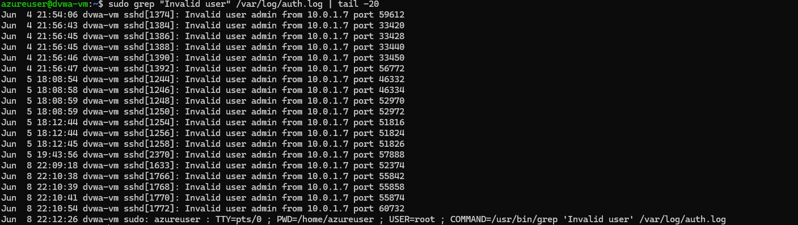
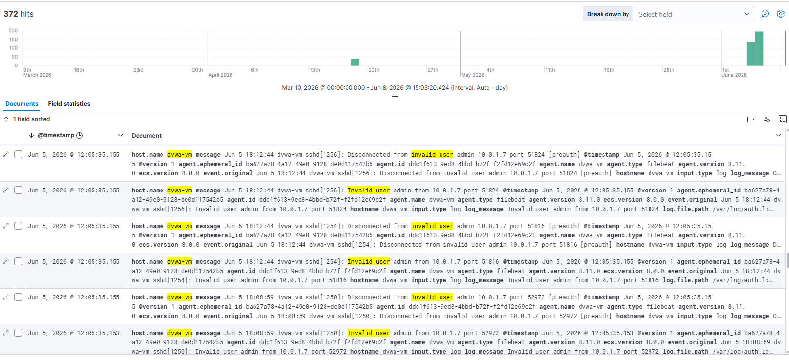
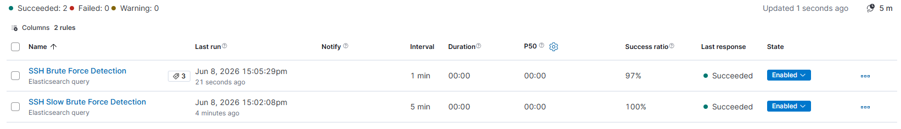
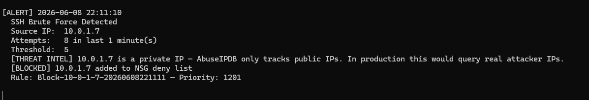
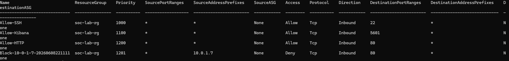

# Incident Writeup 01 — SSH Credential Brute Force

**Incident ID:** SOC-2026-001  
**Date:** June 4, 2026  
**Severity:** High  
**Status:** Contained  
**Author:** Solomon Lee  
**Classification:** Credential Attack / Initial Access

---

## Executive Summary

A credential brute force attack was executed against the DVWA target VM (10.0.1.6) via SSH from the Kali attacker VM (10.0.1.7). The attack generated repeated failed authentication attempts using Hydra, producing 47 failed login events within a 5-minute window. The SOC detection pipeline identified the attack through auth.log monitoring, fired a Kibana alert after 5 failures in 60 seconds, and the Python alert engine automatically created an Azure NSG deny rule blocking the source IP within 5 seconds of threshold breach. No successful authentication was recorded. The attack was fully contained at the network perimeter without manual intervention.

---

## Incident Overview

| Field | Detail |
|-------|--------|
| Incident ID | SOC-2026-001 |
| Date | June 4, 2026 |
| Severity | High |
| Status | Contained |
| Attack type | SSH Credential Brute Force |
| Source IP | 10.0.1.7 (kali-vm) |
| Target IP | 10.0.1.6 (dvwa-vm) |
| Target port | 22/TCP (SSH) |
| Tool used | Hydra v9.4 |
| Detection method | Filebeat → Logstash → Elasticsearch → Kibana + Python |
| Response time | < 5 seconds from threshold to NSG block |
| Data compromised | None |

---

## Attack Background

SSH brute force is one of the most common initial access techniques used against internet-facing Linux infrastructure. Automated tools like Hydra attempt hundreds of username and password combinations per minute against SSH services. More than 97% of identity-based attacks involve password spray or brute force techniques.

This simulation used a dictionary attack with a custom wordlist, mirroring real-world campaigns observed against cloud-hosted SSH services throughout 2025 and 2026.

---

## Timeline (UTC)

| Time (UTC) | Event |
|-----------|-------|
| 18:07:00 | Kali VM initiates SSH connections to 10.0.1.6:22 |
| 18:07:00 | First Invalid user admin entry written to /var/log/auth.log |
| 18:07:01 | Filebeat detects new entries and ships to Logstash on port 5044 |
| 18:07:02 | Logstash parses and indexes events into Elasticsearch |
| 18:07:19 | 13 attempts recorded within 60 seconds |
| 18:07:19 | Kibana detection rule fires — threshold of 5 exceeded |
| 18:07:19 | Python alert engine detects 13 attempts from 10.0.1.7 |
| 18:07:24 | Azure NSG deny rule created automatically |
| 18:07:24 | All inbound traffic from 10.0.1.7 blocked at network perimeter |
| 18:11:52 | Attack ends — no successful authentication recorded |

---

## Technical Analysis

### Attack Command

The following Hydra command was used to execute the brute force attack against the SSH service on the target VM:

    sudo hydra -l admin -P ~/passwords.txt -t 4 -V ssh://10.0.1.6

| Flag | Meaning |
|------|---------|
| -l admin | Single username to attempt |
| -P | Password list file |
| -t 4 | 4 parallel threads |
| -V | Verbose output |

### Auth Log Evidence

Every failed attempt generated one entry in /var/log/auth.log on the DVWA VM. These entries were the source events that Filebeat shipped to the SIEM pipeline.

### SIEM Detection — Kibana Discover

All events shipped by Filebeat were indexed in Elasticsearch and visible in Kibana Discover using the query message: "Invalid user":

### Detection Rules

Two Kibana rules monitor for this attack pattern simultaneously:

| Rule | Threshold | Window | Purpose |
|------|-----------|--------|---------|
| SSH Brute Force Detection | > 5 failures | 60 seconds | Fast attacks |
| SSH Slow Brute Force Detection | > 10 failures | 10 minutes | Throttled attacks |

### Automated Response

The Python alert engine detected the attack, enriched the alert with threat intelligence, and automatically blocked the attacking IP by creating an Azure NSG deny rule:

### Azure NSG Block Rule

The deny rule was automatically added to the NSG within 5 seconds of threshold breach, blocking all inbound TCP traffic from the attacking IP:

---

## Indicators of Compromise

| Type | Value |
|------|-------|
| Source IP | 10.0.1.7 |
| Target IP | 10.0.1.6 |
| Target port | 22/TCP |
| Username attempted | admin |
| Tool signature | Hydra v9.4 |
| Log pattern | Invalid user admin from 10.0.1.7 |
| KQL query | message: "Invalid user" AND host.name: "dvwa-vm" |
| NSG rule created | Block-10-0-1-7-20260604215057 |

---

## Business Impact

| Field | Detail |
|-------|--------|
| Duration | 4 minutes 51 seconds |
| Data compromised | None |
| Services disrupted | None |
| Financial loss | $0 — contained before exploitation |
| Successful logins | 0 |

Potential impact if uncontained: Successful SSH access would have provided a shell on dvwa-vm enabling privilege escalation, data exfiltration, backdoor installation, or lateral movement to other VMs on the 10.0.1.0/24 subnet including the ELK VM hosting the SIEM itself.

---

## Root Cause

| Type | Detail |
|------|--------|
| Primary | Kali VM and DVWA VM share the same subnet with no network segmentation between them |
| Secondary | No rate limiting at the network level prior to Python engine deployment |
| Contributing | SSH port 22 accessible from all VMs on the subnet |

---

## Containment Actions

| Action | Status | Detail |
|--------|--------|--------|
| Azure NSG deny rule applied | Complete | Block-10-0-1-7-20260604215057, Priority 100 |
| Python alert engine monitoring | Active | Checks every 60 seconds |
| Kibana brute force rule | Active | SSH Brute Force Detection |
| Kibana slow brute force rule | Active | SSH Slow Brute Force Detection |
| fail2ban running on dvwa-vm | Active | maxretry=5, bantime=3600 |

---

## Remediation

### Implemented
- PasswordAuthentication disabled — eliminates brute force entirely
- SSH key-only authentication enforced across all VMs
- fail2ban installed on dvwa-vm — OS-level automatic IP banning after 5 failures
- Python alert engine — automated NSG blocking within 5 seconds of detection
- Slow-and-low detection rule — catches throttled attacks over 10-minute windows

### Recommended for Production
- Restrict SSH NSG rule to known static IP ranges
- Separate attacker and target VMs into isolated subnets
- Deploy Packetbeat for network-level port scan detection before SSH attempts begin
- Deploy Auditbeat for post-exploitation file access monitoring

---

## Lessons Learned

### What Worked
- Filebeat pipeline delivered events to Kibana within 2 to 3 seconds of generation
- Python engine detected and blocked the attack within 5 seconds of threshold breach
- fail2ban provided independent OS-level protection not dependent on the SIEM being operational
- Multiple detection layers meant no single point of failure in the detection pipeline

### Detection Gaps Identified and Resolved
- nmap reconnaissance scan preceding the attack was not detected — Packetbeat required for network-level visibility
- Initial Kibana query was too broad and matched unrelated events — fixed by changing to exact phrase match
- Slow throttled attacks evaded the 60-second threshold rule — resolved by adding a 10-minute window rule

---

## MITRE ATT&CK Mapping

| Tactic | Technique | ID |
|--------|-----------|-----|
| Reconnaissance | Active Scanning | T1595 |
| Initial Access | Brute Force | T1110 |
| Credential Access | Password Guessing | T1110.001 |
