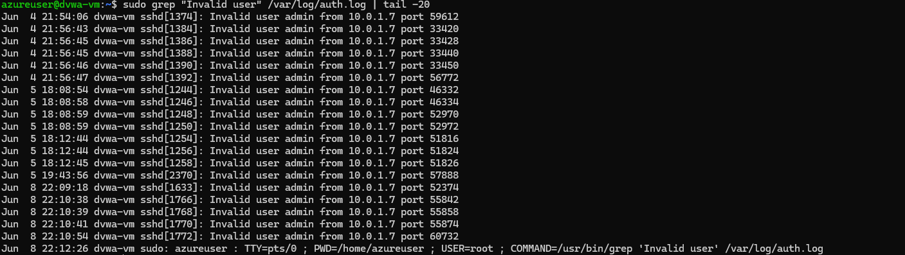
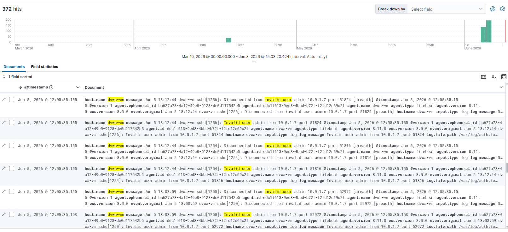
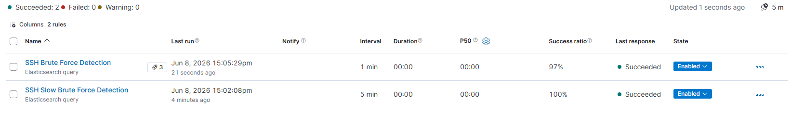
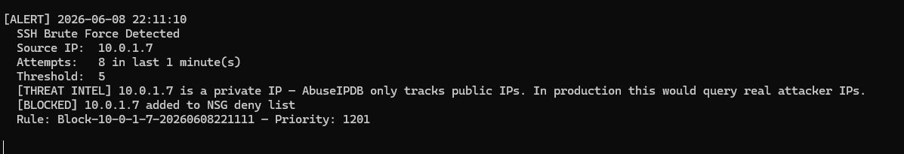
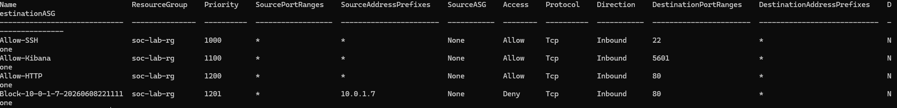

# Incident Report: SOC-2026-001 - SSH Credential Brute Force Attack

| Field | Detail |
| --- | --- |
| Incident ID | SOC-2026-001 |
| Classification | Credential Access / Brute Force |
| Severity | Medium |
| Status | Closed - attack unsuccessful; automated response defect found and fixed |
| Date Detected | June 8, 2026 (earlier simulations June 4 and 5) |
| Post-Incident Review | October 2026 |
| Author | Solomon Lee |
| Last Updated | October 6, 2026 |

---

## 1. Executive Summary

On June 8, 2026, an SSH credential brute force attack was run with Hydra from the Kali VM (10.0.1.7) against the DVWA target VM (10.0.1.6). The target accepts SSH keys only, so every attempt failed. Filebeat shipped the `Invalid user` events from auth.log to the ELK stack, and the Python alert engine raised an alert at 22:11:10 UTC and created an Azure NSG deny rule one second later.

A post-incident review of this report's own evidence found that the deny rule did not block anything. It was created at priority 1201 on port 80 only, after the existing allow rules, because of two defects in the engine. The attempts had already stopped at 22:10:54, before the rule existed, most likely because fail2ban on dvwa-vm banned the source after its fifth failure. The review also found the engine counted each log line twice. Both defects are fixed in `python/alert_engine.py`; a re-test on Azure is pending (Section 13).

No authentication succeeded, no data was accessed, and no services were disrupted.

---

## 2. Severity Rating

| Factor | Assessment |
| --- | --- |
| Incident severity | Medium |
| Outcome | Unsuccessful - target uses key-only SSH authentication |
| Attacker position | Already inside the private subnet (lateral, not internet-facing) |
| Why not Low | The automated response was found not to enforce, so containment relied on a single layer (fail2ban) |
| Why not High | No credential could be guessed and no access was gained |

CVSS rates vulnerabilities, not incidents, so it is not used as this incident's severity. For reference, the exposure a brute force attack looks for, SSH with password authentication reachable over the network, scores 9.8 under CVSS v3.1 (`AV:N/AC:L/PR:N/UI:N/S:U/C:H/I:H/A:H`). That exposure did not exist on dvwa-vm because password authentication was disabled.

---

## 3. Affected Systems

| System | IP Address | Role | Impact |
| --- | --- | --- | --- |
| dvwa-vm | 10.0.1.6 | Target - DVWA web application | Targeted - no access gained |
| kali-vm | 10.0.1.7 | Attacker | Source of attack |
| jump-box | 10.0.1.4 | Bastion host | Not involved |
| elk-vm | 10.0.1.5 | SIEM - ELK Stack | Detection platform - no impact |
| soc-lab-nsg | - | Azure network security group | Received an ineffective auto-block rule |

---

## 4. Incident Details

### Attack Vector

Hydra opened parallel SSH connections to port 22 on dvwa-vm and tried a dictionary of passwords against the username `admin`.

### Why the Attack Was Unsuccessful

dvwa-vm has `PasswordAuthentication no` in `/etc/ssh/sshd_config` and has no `admin` account. The SSH daemon logged each connection as `Invalid user admin` and rejected it without evaluating a password.

---

## 5. Timeline (UTC, June 8, 2026)

| Time (UTC) | Event | Source |
| --- | --- | --- |
| 22:09:18 | First `Invalid user admin from 10.0.1.7` entry in auth.log | auth.log screenshot |
| 22:10:38 - 22:10:54 | Four further attempts (22:10:38, 22:10:39, 22:10:41, 22:10:54) | auth.log screenshot |
| 22:10:54 | Last recorded attempt; this is the fifth failure since 22:09:18, matching fail2ban's `maxretry=5` | auth.log screenshot (fail2ban ban inferred) |
| 22:11:10 | Python engine alerts: 8 attempts from 10.0.1.7 in the last minute (four actual lines, each counted twice) | Engine screenshot |
| 22:11:10 | AbuseIPDB lookup skipped - private IP | Engine screenshot |
| 22:11:11 | Rule `Block-10-0-1-7-20260608221111` created at priority 1201, TCP, port 80 | NSG screenshot |
| 22:11:11 | Rule has no effect: `Allow-SSH` (1000) and `Allow-HTTP` (1200) match first | Post-incident review |
| 22:12:26 | Analyst reviews auth.log on dvwa-vm | auth.log screenshot |

Earlier runs of the same attack on June 4 (21:54 - 21:56) and June 5 (18:08 - 19:43) also appear in auth.log and in Kibana.

---

## 6. Attack Command and Technical Evidence

The following Hydra command was executed from the Kali VM:

```bash
sudo hydra -l admin -P ~/passwords.txt -t 4 -V ssh://10.0.1.6
```

| Flag | Purpose |
| --- | --- |
| `-l admin` | Single target username |
| `-P ~/passwords.txt` | Dictionary wordlist file |
| `-t 4` | 4 parallel connection threads |
| `-V` | Verbose - print every attempt |

Each attempt wrote one line to `/var/log/auth.log` on dvwa-vm:

```
Jun  8 22:10:38 dvwa-vm sshd[1766]: Invalid user admin from 10.0.1.7 port 55842
Jun  8 22:10:39 dvwa-vm sshd[1768]: Invalid user admin from 10.0.1.7 port 55858
Jun  8 22:10:41 dvwa-vm sshd[1770]: Invalid user admin from 10.0.1.7 port 55874
Jun  8 22:10:54 dvwa-vm sshd[1772]: Invalid user admin from 10.0.1.7 port 60732
```



---

## 7. Detection and Evidence

### SIEM Evidence - Kibana Discover

Filebeat shipped auth.log to Logstash, which indexed the events in Elasticsearch. This KQL query returns the attempts from all three runs:

```
message: "Invalid user" AND host.name: "dvwa-vm"
```



### Detection Rules

| Rule Name | Condition | Check Interval | Status |
| --- | --- | --- | --- |
| SSH Brute Force Detection | More than 5 `Invalid user` events in 1 minute | 1 minute | Enabled |
| SSH Slow Brute Force Detection | More than 10 `Invalid user` events in 10 minutes | 5 minutes | Enabled |

The screenshot below was taken on April 18, before the slow rule existed. Kibana's Success ratio column measures whether the rule ran without errors, not whether it detected attacks.



### Automated Response - What Happened

The engine alerted and reported the IP as blocked:



The rule it created is the last row below. It is at priority 1201, after all three allow rules, and covers port 80 only:



Azure evaluates inbound NSG rules from the lowest priority number up and stops at the first match. An SSH packet from 10.0.1.7 matches `Allow-SSH` at 1000 and is allowed; the deny at 1201 is never reached. Even for port 80, `Allow-HTTP` at 1200 matches first.

---

## 8. Impact Assessment

| Category | Rating | Detail |
| --- | --- | --- |
| Confidentiality | None | No data accessed |
| Integrity | None | No files modified |
| Availability | None | No services disrupted |
| Data Compromised | None | Not applicable |
| Records Affected | 0 | Not applicable |
| Control Effectiveness | Degraded | Automated NSG response did not enforce; fail2ban was the effective control |

---

## 9. Operational Status

| Phase | Time (UTC) | Status |
| --- | --- | --- |
| Attack begins | 22:09:18 | Services fully operational |
| Attempts stop | 22:10:54 | Services fully operational |
| Alert raised | 22:11:10 | Services fully operational |
| Incident closed | June 8, 2026 | Resolved - no access gained |
| Response defect identified | October 2026 | Fixed in code; Azure re-test pending |

---

## 10. Indicators of Compromise (IOCs)

| Type | Value | Context |
| --- | --- | --- |
| Source IP | 10.0.1.7 | Kali attacker VM |
| Target IP | 10.0.1.6 | DVWA target VM |
| Target Port | 22/TCP | SSH service |
| Username Attempted | admin | Non-existent account |
| Log Pattern | `Invalid user admin from 10.0.1.7` | auth.log signature |
| Behavior | Short-lived connections from one source, new source port each time | Automated tool pattern |
| KQL Query | `message: "Invalid user" AND host.name: "dvwa-vm"` | Kibana search |

The attacking tool (Hydra) is known from the test plan; sshd does not log a client tool name.

---

## 11. Root Cause Analysis

### Why the attack was possible

| Type | Detail |
| --- | --- |
| Primary Cause | Kali VM and DVWA VM share one subnet with no segmentation |
| Contributing Factor | `Allow-SSH` accepts port 22 from any source rather than the jump box only |
| Why Attack Failed | Key-only SSH: no password mechanism to guess against |

### Why the automated response did not enforce

| Defect | Detail |
| --- | --- |
| Priority placement | `get_next_priority()` returned the highest existing priority plus one (1201), so the Deny was evaluated after every Allow rule |
| Missing port scope | The `az network nsg rule create` call set no destination port; the Azure CLI defaults it to 80, so port 22 was never covered |
| Duplicate check | Any rule mentioning the IP counted as "already blocked", so the broken rule would have prevented a correct one on the next run |
| Session state | The IP was recorded as blocked whether or not the Azure call succeeded |

### Why the attempt count was doubled

The engine counted 8 attempts in a minute that contained 4. The Filebeat configuration read auth.log through both a log input and the system module, so each line was likely indexed twice. This inflated the count past the threshold of 5.

---

## 12. Containment and Eradication

| Action | Method | Time (UTC) | Result |
| --- | --- | --- | --- |
| Source likely banned on dvwa-vm | fail2ban (`maxretry=5`) | 22:10:54 (inferred) | Attempts stopped |
| Kibana alert | SSH Brute Force Detection rule | 22:11 | Logged |
| NSG deny rule created | Python alert engine | 22:11:11 | Ineffective - priority 1201, port 80 |

To confirm the fail2ban ban from dvwa-vm: `sudo zgrep 10.0.1.7 /var/log/fail2ban.log*`.

---

## 13. Remediation and Verification

### Code fixes (python/alert_engine.py)

- The Deny is placed in the lowest free priority below the first Allow rule (100-999), so it is evaluated first
- The rule covers all protocols and all source and destination ports
- An existing rule only counts as a block if it is a Deny for that IP on all ports, ahead of every Allow
- The IP is recorded as blocked only after Azure confirms the rule
- Events are de-duplicated by file path and offset before counting
- `--unblock IP` deletes the engine's Deny rules to reset the lab

Tested against a simulated Azure CLI seeded with the June 8 rules: the original code reproduces the 1201 / port 80 rule exactly and SSH from 10.0.1.7 is still allowed; the fixed code creates a priority 100, all-ports Deny and SSH from 10.0.1.7 is denied, while SSH from the jump box is still allowed.

### Configuration fix (ansible filebeat template)

The system module was removed so auth.log and syslog are read by one input only.

### Azure re-test (pending)

1. Delete the old rule: `python3 alert_engine.py --unblock 10.0.1.7`
2. From kali-vm, confirm SSH is reachable: `nc -vz 10.0.1.6 22`
3. Run the engine, then run Hydra from kali-vm until the alert fires
4. From kali-vm, `nc -vz 10.0.1.6 22` should now time out
5. Confirm the Deny is evaluated first: `az network nic list-effective-nsg --resource-group soc-lab-rg --name <dvwa-vm NIC name>`
6. Replace the response screenshots in Section 7 and update this section with the results

### Recommended for production

- Restrict `Allow-SSH` to the jump box (10.0.1.4) instead of any source
- Segment attacker-accessible and SIEM systems into separate subnets
- Add a block expiry so automated rules do not accumulate
- Alert when an automated response fails, not only when it succeeds
- Deploy Packetbeat for network-level reconnaissance detection

---

## 14. Lessons Learned

### What worked

- Filebeat delivered auth.log events to Elasticsearch within seconds
- Key-only SSH made the attack impossible regardless of other controls
- fail2ban worked independently of the SIEM and appears to have stopped the attack when the automated response did not

### What did not work

- The automated NSG response reported success but created a rule that blocked nothing
- The engine's attempt count was inflated by duplicate ingestion
- The response was never verified against live traffic; "rule created" was treated as "attacker blocked"

### The main lesson

An automated response has to be tested by checking whether the traffic actually stops, not whether the command returned success. Reviewing my own evidence surfaced three defects that a passing exit code had hidden.

### Detection gaps

- The nmap scan that preceded the attack was not detected; Filebeat reads log files and does not see SYN packets
- Slow attacks below 5 per minute are covered only by the 10-minute rule

---

## 15. MITRE ATT&CK Mapping

| Tactic | Technique | ID | Detected |
| --- | --- | --- | --- |
| Discovery | Network Service Discovery (nmap scan) | T1046 | No - needs Packetbeat |
| Credential Access | Brute Force: Password Guessing | T1110.001 | Yes - auth.log via Filebeat |

---

## Appendix - Detection and Response Pipeline

```
dvwa-vm (/var/log/auth.log)
    |
    | Filebeat 8.11.0 (one input per file)
    |
elk-vm Logstash :5044
    |
Elasticsearch (filebeat-8.11.0-YYYY.MM.dd)
    |
    +-- Kibana Rules
    |       SSH Brute Force Detection       (>5 in 1 min, every 1 min)
    |       SSH Slow Brute Force Detection  (>10 in 10 min, every 5 min)
    |
    +-- Python alert_engine.py (every 60s)
            De-duplicate events by file path + offset
            Regex extracts source IP from message field
            Count per-IP attempts in the window
            AbuseIPDB lookup (public IPs only)
            Azure CLI: Deny, all ports and protocols,
              lowest free priority below the first Allow rule
```
