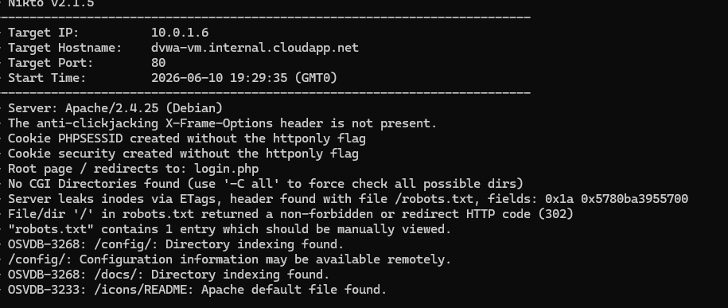
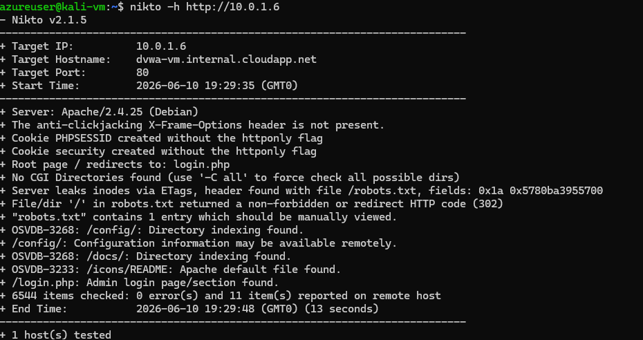
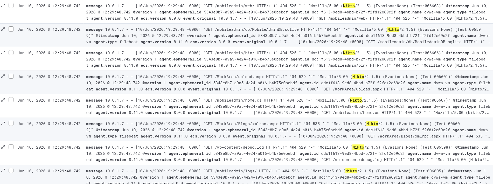
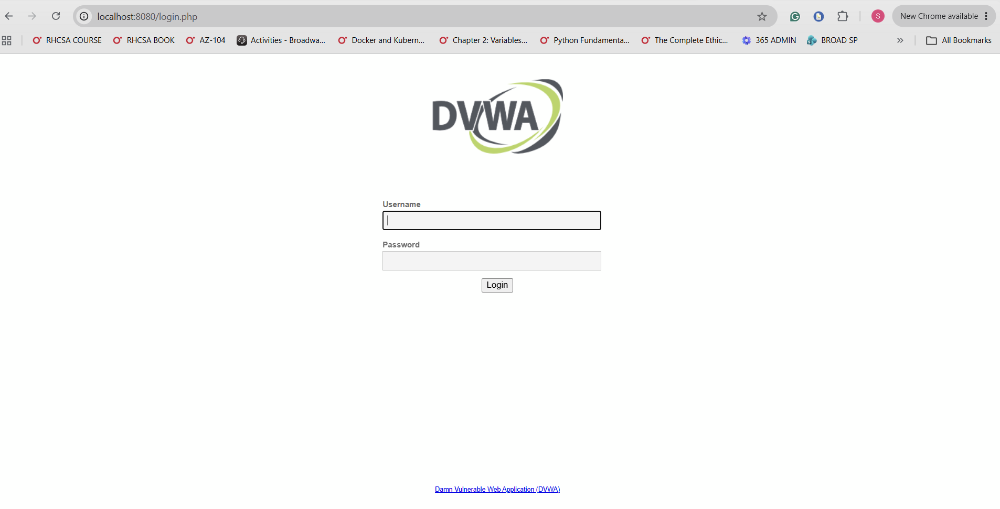

# Incident Report: SOC-2026-002 - Web Application Reconnaissance

| Field | Detail |
| --- | --- |
| Incident ID | SOC-2026-002 |
| Classification | Reconnaissance / Web Application Scanning |
| Severity | Medium |
| CVSS v3.1 Score | 5.3 - Medium |
| CVSS Vector | AV:N/AC:L/PR:N/UI:N/S:U/C:L/I:N/A:N |
| Status | Contained |
| Date Detected | June 5, 2026 |
| Date Contained | June 5, 2026 |
| Author | Solomon Lee |
| Last Updated | June 8, 2026 |

---

## 1. Executive Summary

On June 5, 2026, a web application reconnaissance scan was executed against the DVWA target VM (10.0.1.6) from the Kali attacker VM (10.0.1.7) using Nikto, an open source web vulnerability scanner. The scan generated 6,216 HTTP requests over approximately 4 minutes, probing the DVWA web application for known vulnerabilities, misconfigurations, exposed directories, and outdated software components.

Nikto identified 11 findings including missing security headers, exposed configuration directories, and outdated Apache and PHP versions with known CVEs. The scan was fully captured by the SIEM pipeline after Apache logs were added to Filebeat configuration, closing a detection gap that existed earlier in the project. No exploitation occurred during this incident — this was a reconnaissance and enumeration phase only.

---

## 2. Severity Rating

| Metric | Rating | Justification |
| --- | --- | --- |
| CVSS v3.1 Base Score | 5.3 - Medium | Network-based passive scanning with no exploitation |
| Attack Vector | Network | Attack originated over the network |
| Attack Complexity | Low | Automated scanning requires no special conditions |
| Privileges Required | None | No authentication required to scan |
| User Interaction | None | Fully automated scan |
| Confidentiality Impact | Low | Scanning reveals server information and vulnerabilities |
| Integrity Impact | None | No modifications made during reconnaissance |
| Availability Impact | None | No services disrupted by the scan |

Reconnaissance alone scores Medium severity. The real risk is what follows — the vulnerabilities discovered during this scan provide the roadmap for exploitation in subsequent attacks.

---

## 3. Affected Systems

| System | IP Address | Role | Impact |
| --- | --- | --- | --- |
| dvwa-vm | 10.0.1.6 | Target - DVWA web application | Scanned - 11 findings identified |
| kali-vm | 10.0.1.7 | Attacker - Kali Linux | Source of scan |
| jump-box | 10.0.1.4 | Bastion host | No impact |
| elk-vm | 10.0.1.5 | SIEM - ELK Stack | Detection platform - no impact |

No systems were compromised. The scan was passive enumeration only. All 11 findings represent vulnerabilities in the DVWA application that were intentionally present as DVWA is a deliberately vulnerable application for security training.

---

## 4. Incident Details

### Attack Vector

The attacker used Nikto, an automated web vulnerability scanner, to enumerate the DVWA web application. Nikto sends thousands of HTTP requests testing for known vulnerabilities, exposed files, outdated software, and misconfigurations. The tool is widely used by penetration testers and attackers during the reconnaissance phase of an engagement.

### What Was Discovered

Nikto identified 11 findings across the following categories:

| Finding | Category | Risk |
| --- | --- | --- |
| Missing X-Frame-Options header | Security misconfiguration | Enables clickjacking attacks |
| Missing X-Content-Type-Options header | Security misconfiguration | Enables MIME-type sniffing |
| Cookies without HttpOnly flag | Security misconfiguration | Session cookies exposed to JavaScript |
| /config/ directory accessible | Information disclosure | May expose database credentials |
| Apache 2.4.25 outdated | Vulnerable component | Multiple known CVEs |
| PHP outdated version | Vulnerable component | Multiple known CVEs |
| Admin login page found at /login.php | Information disclosure | Brute force target identified |
| Default Apache test files present | Security misconfiguration | Reveals server version |
| Directory listing enabled | Information disclosure | Exposes file structure |
| /dvwa/ path disclosed | Information disclosure | Application path revealed |
| HTTP TRACE method enabled | Security misconfiguration | Enables cross-site tracing attacks |

### OWASP Top 10 Mapping of Findings

| Finding | OWASP Category |
| --- | --- |
| Missing security headers | A05 - Security Misconfiguration |
| Cookies without HttpOnly | A05 - Security Misconfiguration |
| Exposed /config/ directory | A05 - Security Misconfiguration |
| Outdated Apache and PHP | A06 - Vulnerable and Outdated Components |
| Admin login page exposed | A07 - Identification and Authentication Failures |

### Why This Phase Matters

Reconnaissance is Stage 1 of the cyber kill chain. The information gathered during this scan directly enables subsequent attacks. Knowing the exact Apache and PHP versions allows an attacker to search CVE databases for matching exploits. Knowing the admin login page location enables targeted credential attacks. Knowing cookies lack HttpOnly flags enables JavaScript-based session theft if XSS is also present.

---

## 5. Timeline (UTC)

| Time (UTC) | Event |
| --- | --- |
| 19:31:00 | Kali VM (10.0.1.7) initiates Nikto scan against 10.0.1.6 port 80 |
| 19:31:00 | First HTTP request logged in Apache access.log inside DVWA container |
| 19:31:01 | Filebeat detects new entries in /var/log/dvwa-apache/access.log |
| 19:31:01 | Filebeat ships Apache log events to Logstash at 10.0.1.5:5044 |
| 19:31:02 | Logstash indexes events into Elasticsearch under filebeat-8.11.0-2026.06.05 |
| 19:31:53 | Nikto scan actively testing PUT and DELETE methods |
| 19:35:00 | Nikto scan completes - 11 findings reported |
| 19:35:00 | 6,216 HTTP request events indexed in Elasticsearch |
| 19:35:00 | All scan events visible in Kibana Discover |

---

## 6. Attack Command and Technical Evidence

The following Nikto command was executed from the Kali VM:

```bash
nikto -h http://10.0.1.6
```

| Flag | Purpose |
| --- | --- |
| `-h http://10.0.1.6` | Target host and protocol |

Nikto uses the Mozilla/5.00 (Nikto/2.1.5) user agent string which is visible in every Apache log entry, making scans trivially identifiable.





Each HTTP request generated one entry in the Apache access.log inside the DVWA container, mounted to `/var/log/dvwa-apache/access.log` on the VM:

```
10.0.1.7 - - [05/Jun/2026:19:31:53 +0000] "PUT /nikto-test-dhorVaBe.html HTTP/1.1" 405 605 "-" "Mozilla/5.00 (Nikto/2.1.5) (Evasions:None) (Test:put_del_test: PUT)"
10.0.1.7 - - [05/Jun/2026:19:31:53 +0000] "GET /config/ HTTP/1.1" 200 1024 "-" "Mozilla/5.00 (Nikto/2.1.5) (Evasions:None) (Test:config_dir)"
10.0.1.7 - - [05/Jun/2026:19:31:53 +0000] "GET /login.php HTTP/1.1" 200 1842 "-" "Mozilla/5.00 (Nikto/2.1.5) (Evasions:None) (Test:login_page)"
```

---

## 7. Detection and Evidence

### SIEM Evidence - Kibana Discover

All Apache log events were shipped by Filebeat and indexed in Elasticsearch. The following KQL query returns all Nikto scan events:

```
message: "Nikto"
```



### Detection Gap That Was Closed

This scan was **not detected** when it was first run on April 18, 2026. At that time Filebeat was only watching `/var/log/auth.log` and `/var/log/syslog`. Apache logs were inside the DVWA Docker container and invisible to the SIEM.

The gap was closed by:

1. Recreating the DVWA container with a volume mount exposing Apache logs to the VM filesystem
2. Adding `/var/log/dvwa-apache/access.log` and `/var/log/dvwa-apache/error.log` to Filebeat configuration
3. Restarting Filebeat to pick up the new paths

When the scan was re-run on June 5, 2026 all 6,216 requests were captured.

### Target Application



---

## 8. Impact Assessment

| Category | Rating | Detail |
| --- | --- | --- |
| Confidentiality | Low | Server versions, paths, and configurations disclosed |
| Integrity | None | No files modified |
| Availability | None | No services disrupted |
| Data Compromised | None | No application data accessed |
| Records Affected | 0 | Not applicable |
| Financial Loss | $0 | Not applicable |
| Regulatory Impact | None | No breach occurred |

The direct impact of reconnaissance is low. The indirect risk is high — the findings provide an attacker with a complete roadmap for exploitation.

---

## 9. Operational Status

| Phase | Time (UTC) | Status |
| --- | --- | --- |
| Scan begins | 19:31:00 | Services fully operational |
| Scan detected in SIEM | 19:31:02 | Services fully operational |
| Scan completes | 19:35:00 | Services fully operational |
| Incident closed | June 5, 2026 19:45:00 UTC | Resolved |

No services were interrupted at any point. DVWA remained accessible throughout the scan. The scan generated no errors or crashes on the target system.

---

## 10. Indicators of Compromise (IOCs)

| Type | Value | Context |
| --- | --- | --- |
| Source IP | 10.0.1.7 | Kali attacker VM |
| Target IP | 10.0.1.6 | DVWA target VM |
| Target Port | 80/TCP | HTTP web application |
| Scanner User Agent | `Mozilla/5.00 (Nikto/2.1.5)` | Present in every request |
| Request Volume | 6,216 requests in 4 minutes | Abnormal volume for single IP |
| Log Pattern | `Nikto` in Apache access.log | Scanner signature |
| KQL Query | `message: "Nikto" AND host.name: "dvwa-vm"` | Kibana detection |
| Paths Probed | /config/, /login.php, /dvwa/, /admin/ | Enumerated application structure |

---

## 11. Root Cause Analysis

| Type | Detail |
| --- | --- |
| Primary Cause | DVWA is intentionally vulnerable - misconfigured by design for security training |
| Secondary Cause | No web application firewall or rate limiting on HTTP port 80 |
| Contributing Factor | Apache logs were not initially monitored by Filebeat - detection gap existed |
| Detection Gap Resolved | Volume mount added to DVWA container, Apache logs added to Filebeat config |

---

## 12. Containment and Eradication

| Action | Method | Time (UTC) | Status |
| --- | --- | --- | --- |
| Scan traffic logged in SIEM | Filebeat Apache log monitoring | 19:31:02 | Complete |
| All 6,216 events indexed | Elasticsearch | 19:35:00 | Complete |
| Findings documented | This incident report | June 8, 2026 | Complete |

No active blocking was required. Reconnaissance alone does not warrant an automated NSG block in this lab environment. In production a web application firewall would rate-limit and block the scanning IP after detecting the abnormal request volume and Nikto user agent.

---

## 13. Recovery

No recovery actions were required. No systems were compromised and no data was exfiltrated. The scan was passive enumeration only.

---

## 14. Remediation

### Implemented During This Project

- Apache logs added to Filebeat monitoring - web scans now fully visible in SIEM
- DVWA container recreated with volume mount exposing logs to host filesystem
- Detection coverage matrix updated to include web application scanning

### Recommended for Production Environments

- Deploy a Web Application Firewall (WAF) to detect and block automated scanners
- Add rate limiting on HTTP - block IPs exceeding 100 requests per minute
- Create a Kibana detection rule for high-volume requests from a single IP
- Remove default Apache test files and disable directory listing
- Update Apache and PHP to current supported versions
- Add security headers: X-Frame-Options, X-Content-Type-Options, Content-Security-Policy
- Set HttpOnly and Secure flags on all session cookies
- Restrict /config/ directory access via Apache configuration

---

## 15. Lessons Learned

### What Worked Well

- Apache log volume mount solution effectively exposed container logs to Filebeat
- 6,216 scan events captured and indexed within seconds of being generated
- Nikto user agent string makes automated scans trivially identifiable in logs

### Detection Gap Identified and Resolved

The most important lesson from this incident is that **log collection scope matters**. The scan was completely invisible to the SIEM on April 18, 2026 because Filebeat was only watching system logs. Web application activity was happening in an entirely separate log file inside a Docker container.

This is a common real-world gap - organizations monitor OS-level logs but miss application-level logs. Every log source that could contain security-relevant events must be explicitly added to the collection pipeline.

### Process Improvements Made

- DVWA container rebuilt with `-v /var/log/dvwa-apache:/var/log/apache2` volume mount
- Filebeat configuration updated with Apache log paths
- Detection coverage matrix updated to mark web scanning as detected

---

## 16. MITRE ATT&CK Mapping

| Tactic | Technique | Sub-technique | ID | Detected |
| --- | --- | --- | --- | --- |
| Reconnaissance | Active Scanning | Vulnerability Scanning | T1595.002 | Yes - Apache logs via Filebeat |
| Reconnaissance | Gather Victim Host Information | Software | T1592.002 | Yes - Apache logs via Filebeat |
| Discovery | Network Service Discovery | | T1046 | Yes - Apache logs via Filebeat |

---

## Appendix - Detection Pipeline Reference

```
dvwa-vm (/var/log/dvwa-apache/access.log)
    |
    | Volume mount: container /var/log/apache2 -> host /var/log/dvwa-apache
    |
    | Filebeat 8.11.0
    |
elk-vm Logstash :5044
    |
    | Grok filter - parses Apache Combined Log Format
    |
Elasticsearch (filebeat-8.11.0-2026.06.05)
    |
    +-- Kibana Discover
            Query: message: "Nikto"
            Returns all 6,216 scan request events
            Source IP, timestamp, method, path, status code all visible
```
