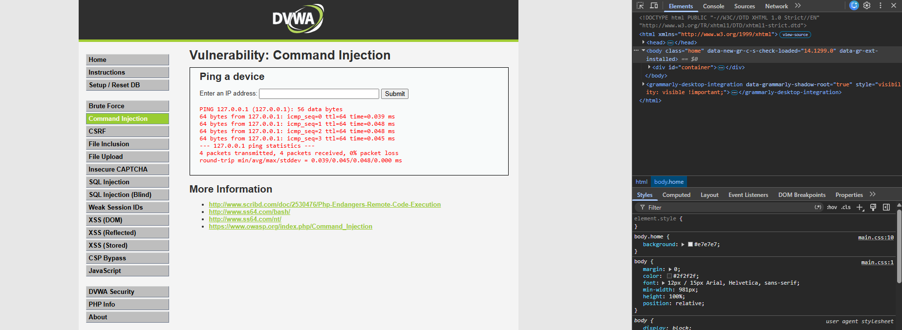
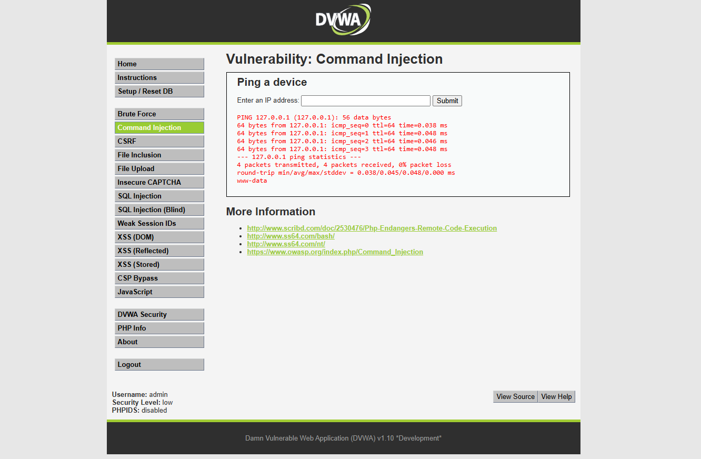
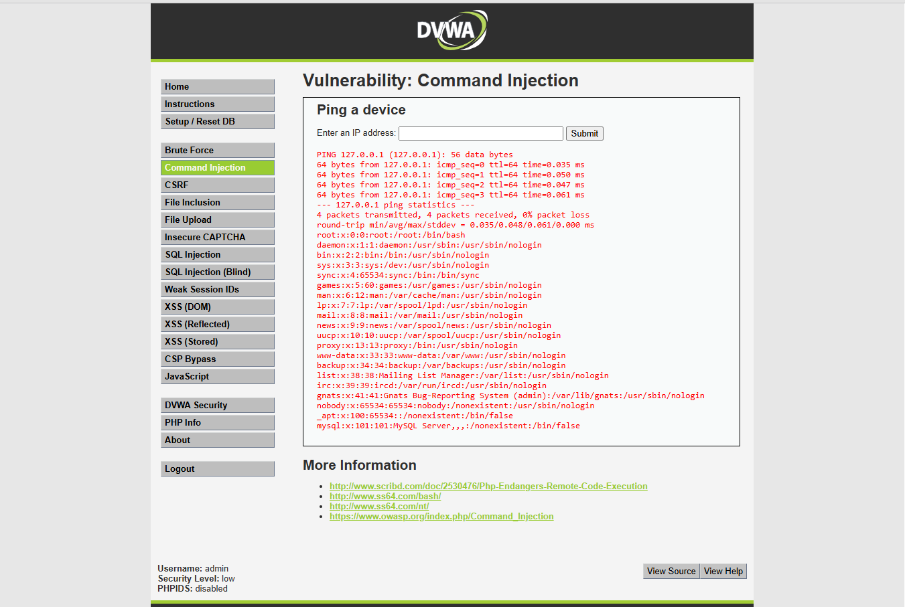
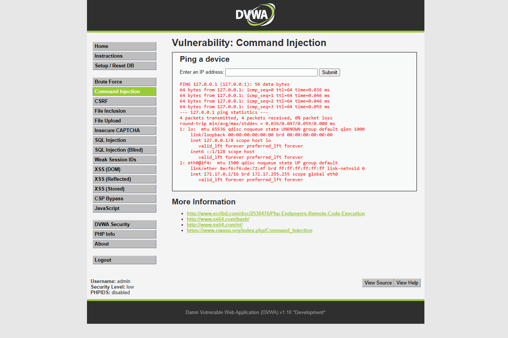
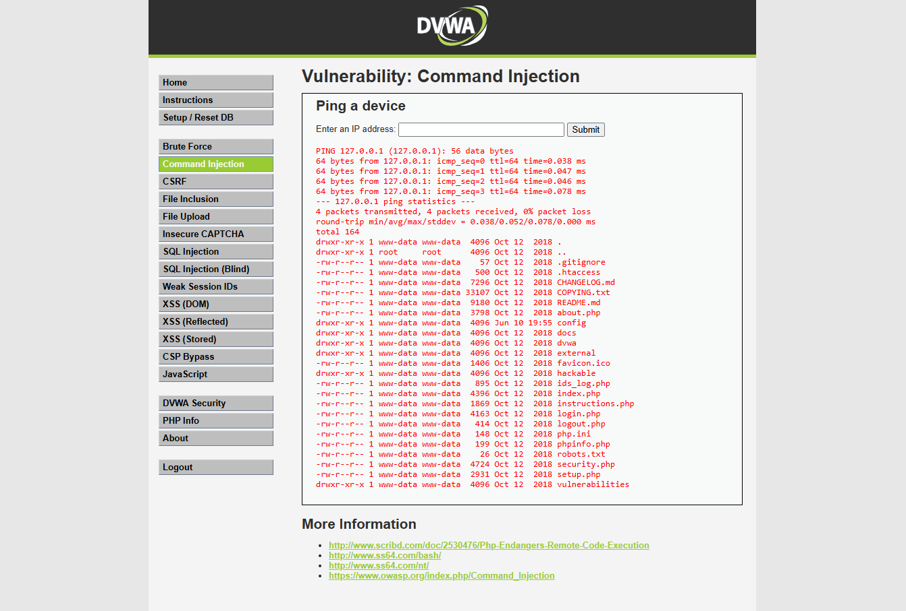
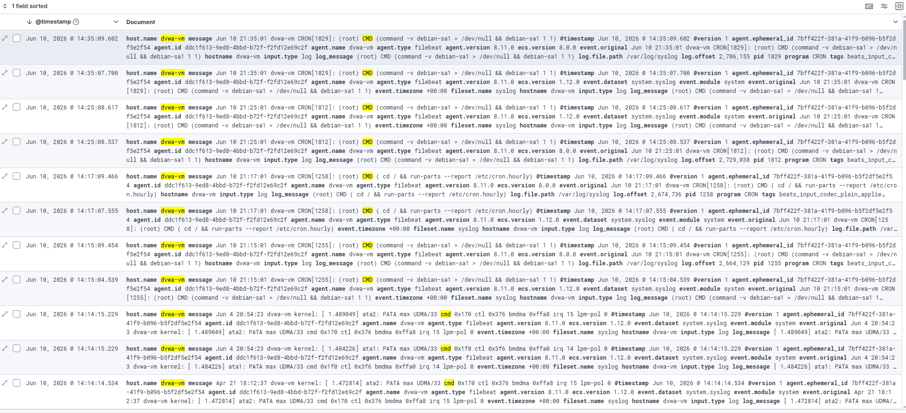

# Incident Report: SOC-2026-005 - Command Injection Attack

| Field | Detail |
| --- | --- |
| Incident ID | SOC-2026-005 |
| Classification | Injection / OS Command Injection |
| Severity | Critical |
| CVSS v3.1 Score | 9.8 - Critical |
| CVSS Vector | AV:N/AC:L/PR:N/UI:N/S:U/C:H/I:H/A:H |
| Status | Contained |
| Date Detected | June 10, 2026 |
| Date Contained | June 10, 2026 |
| Author | Solomon Lee |
| Last Updated | June 10, 2026 |

---

## 1. Executive Summary

On June 10, 2026, an OS command injection attack was executed against the DVWA web application (10.0.1.6) targeting the Command Injection module. The attack exploited an unsanitized input field that passes user-supplied data directly to the operating system shell. By chaining additional commands using the `&&` operator, the attacker was able to execute arbitrary OS commands on the underlying server.

Five progressive attack stages were executed: baseline ping verification, user context discovery via whoami, sensitive file extraction from /etc/passwd, network interface enumeration via ip addr, and web server file system enumeration via ls. All commands executed with the privileges of the Apache web server process. All attack requests were logged in the Apache access log and indexed in Elasticsearch. Command injection is rated Critical as it provides direct access to the underlying operating system — the most severe outcome of a web application vulnerability.

---

## 2. Severity Rating

| Metric | Rating | Justification |
| --- | --- | --- |
| CVSS v3.1 Base Score | 9.8 - Critical | Direct OS command execution with no authentication |
| Attack Vector | Network | Attack delivered via HTTP |
| Attack Complexity | Low | Simple command chaining operators, no special conditions |
| Privileges Required | None | No authentication required to exploit |
| User Interaction | None | Fully automated attack, no victim action required |
| Confidentiality Impact | High | OS files, credentials, and network topology exposed |
| Integrity Impact | High | Attacker can create, modify, or delete files on the server |
| Availability Impact | High | Attacker can terminate processes or delete critical files |

Command injection is the most severe web application vulnerability category because it bypasses the application layer entirely and gives the attacker direct access to the operating system. Unlike SQL injection which is constrained to database operations, command injection enables full server compromise.

---

## 3. Affected Systems

| System | IP Address | Role | Impact |
| --- | --- | --- | --- |
| dvwa-vm | 10.0.1.6 | Target - DVWA web application | Exploited - OS commands executed on server |
| kali-vm | 10.0.1.7 | Attacker - Kali Linux | Source of attack |
| jump-box | 10.0.1.4 | Bastion host | No impact |
| elk-vm | 10.0.1.5 | SIEM - ELK Stack | Detection platform - no impact |

The dvwa-vm operating system was directly accessed during this attack. System files were read, network configuration was disclosed, and web server file structure was enumerated. In a real attack this level of access would enable full server compromise within minutes.

---

## 4. Incident Details

### Vulnerability Description

Command injection occurs when an application passes user-supplied input to a system shell function without proper sanitization. The application is designed to ping an IP address entered by the user. Instead of validating that the input is an IP address, it passes the raw input directly to the shell:

```php
// Vulnerable code
shell_exec('ping -c 4 ' . $_GET['ip']);

// With attacker input: 127.0.0.1 && whoami
// Becomes: ping -c 4 127.0.0.1 && whoami
// Shell executes both commands
```

The `&&` operator in Linux shell means execute the second command only if the first succeeds. Other chaining operators include `;` which runs commands sequentially regardless of success, and `|` which pipes output of one command to the next.

### Why This Vulnerability Is Critical

A web application vulnerability that enables OS command execution effectively gives the attacker the same capabilities as a legitimate system administrator. From command injection an attacker can:

- Read any file the web server user has permission to access
- Write files to the web server directory including web shells for persistent access
- Establish reverse shell connections back to the attacker
- Enumerate the internal network and pivot to other systems
- Install malware or cryptocurrency miners
- Exfiltrate the entire database by piping output to a remote server

---

## 5. Timeline (UTC)

| Time (UTC) | Event |
| --- | --- |
| 20:10:00 | Attacker navigates to DVWA Command Injection module |
| 20:10:10 | Stage 1 - Normal ping to 127.0.0.1 - baseline behavior confirmed |
| 20:10:30 | Stage 2 - Command chain 127.0.0.1 && whoami - user context identified |
| 20:10:50 | Stage 3 - Command chain 127.0.0.1 && cat /etc/passwd - system users extracted |
| 20:11:10 | Stage 4 - Command chain 127.0.0.1 && ip addr - network topology disclosed |
| 20:11:30 | Stage 5 - Command chain 127.0.0.1 && ls -la /var/www/html - file system enumerated |
| 20:11:35 | All HTTP requests logged in Apache access.log |
| 20:11:40 | Filebeat ships events to Elasticsearch |
| 20:12:00 | All attack events visible in Kibana Discover |

---

## 6. Attack Execution and Evidence

### Stage 1 - Baseline Normal Query

Submitted to the Enter an IP address field:

```
127.0.0.1
```

Standard ping output confirming the application pings the supplied IP address as expected.



### Stage 2 - User Context Discovery

```
127.0.0.1 && whoami
```

The `&&` operator chains a second OS command after the ping. The application executed both commands and returned both outputs. The whoami command revealed the username under which the Apache web server process is running. This identifies the privilege level available to the attacker for subsequent commands.



### Stage 3 - Sensitive File Extraction

```
127.0.0.1 && cat /etc/passwd
```

The /etc/passwd file contains every user account defined on the Linux system including usernames, user IDs, group IDs, home directories, and default shells. This information is used by attackers to identify valid usernames for subsequent credential attacks and to understand the system's user structure.



### Stage 4 - Network Topology Discovery

```
127.0.0.1 && ip addr
```

The ip addr command reveals all network interfaces and their IP addresses on the server. This discloses the internal network configuration of dvwa-vm including its position within the 10.0.1.0/24 subnet. An attacker uses this information to identify other reachable hosts for lateral movement.



### Stage 5 - Web Server File System Enumeration

```
127.0.0.1 && ls -la /var/www/html
```

Listing the web server document root reveals all files and directories accessible through the web application. This identifies configuration files, backup files, database connection files, and other sensitive files that may contain credentials or application secrets. The -la flags show hidden files and detailed permissions.



---

## 7. Detection and Evidence

### SIEM Evidence - Kibana Discover

All command injection payloads were transmitted as HTTP GET parameters and logged in the Apache access.log. The injected commands appear URL-encoded in the request URI:

```
message: "cmd" AND host.name: "dvwa-vm"
```



### How Commands Appear in Apache Logs

The injected commands appear URL-encoded in the Apache access log:

```
10.0.1.7 - - [10/Jun/2026] "GET /vulnerabilities/exec/?ip=127.0.0.1+%26%26+whoami HTTP/1.1" 200 1842
10.0.1.7 - - [10/Jun/2026] "GET /vulnerabilities/exec/?ip=127.0.0.1+%26%26+cat+%2Fetc%2Fpasswd HTTP/1.1" 200 3241
10.0.1.7 - - [10/Jun/2026] "GET /vulnerabilities/exec/?ip=127.0.0.1+%26%26+ip+addr HTTP/1.1" 200 2156
```

`%26%26` is the URL encoding for `&&` and `%2F` is the URL encoding for `/`. These patterns are detectable with a properly tuned WAF or Kibana detection rule.

---

## 8. Impact Assessment

| Category | Rating | Detail |
| --- | --- | --- |
| Confidentiality | Critical | OS files, user accounts, network topology all disclosed |
| Integrity | Critical | Attacker could write files, install backdoors, modify configs |
| Availability | High | Attacker could terminate processes or delete critical files |
| Data Compromised | /etc/passwd, network config, file system structure | System reconnaissance data |
| Records Affected | All system user accounts | /etc/passwd contents extracted |
| Financial Loss | Severe in production | Full server compromise enables any downstream attack |
| Regulatory Impact | Severe in production | Unauthorized system access constitutes a breach |

### Escalation Path from Command Injection

From the access gained in this simulation an attacker in a production environment would proceed as follows:

1. Write a PHP web shell to /var/www/html/ for persistent backdoor access
2. Establish a reverse shell connection to an attacker-controlled server
3. Use the network topology from Stage 4 to identify and attack neighboring systems
4. Extract database credentials from DVWA configuration files
5. Exfiltrate the database contents identified in the SQL injection writeup

Command injection is often the final step that converts a web application vulnerability into full server compromise.

---

## 9. Operational Status

| Phase | Time (UTC) | Status |
| --- | --- | --- |
| Attack begins | 20:10:00 | Services fully operational |
| OS commands executing | 20:10:30 | Services fully operational |
| Network topology disclosed | 20:11:10 | Services fully operational |
| All events in SIEM | 20:12:00 | Services fully operational |
| Incident closed | June 10, 2026 20:30:00 UTC | Resolved |

No services were disrupted. The attack was read-only enumeration. No files were created or modified during this simulation.

---

## 10. Indicators of Compromise (IOCs)

| Type | Value | Context |
| --- | --- | --- |
| Source IP | 10.0.1.7 | Kali attacker VM |
| Target IP | 10.0.1.6 | DVWA target VM |
| Target Port | 80/TCP | HTTP web application |
| Target URL | `/vulnerabilities/exec/` | Command injection endpoint |
| Payload Pattern | `&&` in URL parameter | Command chaining operator |
| Payload Pattern | `%26%26` URL-encoded | `&&` in Apache logs |
| Payload Pattern | `cat /etc/passwd` | Sensitive file access |
| Payload Pattern | `ip addr` | Network reconnaissance |
| Log Pattern | `exec/?ip=` in Apache access.log | Command injection module access |
| KQL Query | `message: "cmd" AND host.name: "dvwa-vm"` | Kibana detection |

---

## 11. Root Cause Analysis

| Type | Detail |
| --- | --- |
| Primary Cause | User input passed directly to shell_exec without sanitization or validation |
| Secondary Cause | No input validation to confirm supplied value is a valid IP address format |
| Contributing Factor | Web server process running with broader file read permissions than necessary |
| Contributing Factor | No Web Application Firewall to detect command injection patterns |
| Contributing Factor | DVWA intentionally configured at Low security level for training purposes |

### Secure Code Comparison

```php
// Vulnerable - passes raw input to shell
shell_exec('ping -c 4 ' . $_GET['ip']);

// Secure - validates IP format before use
$ip = $_GET['ip'];
if (filter_var($ip, FILTER_VALIDATE_IP)) {
    shell_exec('ping -c 4 ' . escapeshellarg($ip));
} else {
    echo 'Invalid IP address';
}
```

`filter_var` with `FILTER_VALIDATE_IP` ensures only valid IP addresses are accepted. `escapeshellarg` wraps the value in single quotes and escapes any special characters, preventing command chaining even if validation is bypassed.

---

## 12. Containment and Eradication

| Action | Method | Time (UTC) | Status |
| --- | --- | --- | --- |
| Attack requests logged in SIEM | Apache logs via Filebeat | 20:11:40 | Complete |
| All events indexed in Elasticsearch | Logstash pipeline | 20:12:00 | Complete |
| No files created during attack | Confirmed by file system check | 20:30:00 | Confirmed |
| Findings documented | This incident report | June 10, 2026 | Complete |

No persistent changes were made to the system during this simulation. No web shells or backdoors were installed.

---

## 13. Recovery

In a production environment recovery would require:

- Immediate isolation of the compromised server from the network
- Full file system audit to identify any web shells or backdoors installed
- Review of all cron jobs and startup scripts for persistence mechanisms
- Audit of all outbound network connections from the compromised server
- Password rotation for all accounts whose credentials were visible in /etc/passwd
- Complete OS reinstall if the extent of compromise cannot be determined

In this lab environment no recovery was required as no persistent changes were made.

---

## 14. Remediation

### Critical - Fix Immediately in Production

- Validate all user input against expected format before use - IP fields accept only valid IP addresses
- Use `escapeshellarg()` or `escapeshellcmd()` to sanitize any input passed to shell functions
- Eliminate shell_exec, exec, system, and passthru calls where possible - use native language functions instead
- Run web server process under a dedicated low-privilege user with minimal file system permissions

### High - Implement Within One Week

- Deploy Web Application Firewall with rules detecting command injection operators in URL parameters
- Implement application-level allow-listing - only accept input matching expected patterns
- Review all application code for any other locations where user input reaches shell functions

### Medium - Implement Within One Month

- Add Kibana detection rule for URL-encoded command chaining patterns in Apache logs
- Implement file integrity monitoring to detect web shells being written to the document root
- Deploy Auditbeat to monitor system calls and detect unusual process spawning from the web server

---

## 15. Lessons Learned

### What Worked Well

- Apache log pipeline captured all injected commands URL-encoded in request parameters
- The progressive attack methodology clearly demonstrated the escalating risk from each stage
- Network topology disclosure in Stage 4 illustrated the lateral movement risk from a single compromised VM

### Detection Gaps Identified

- No automated SIEM alert fires for command injection patterns in web requests
- URL-encoded operators require pattern matching on `%26%26`, `%3B`, and `%7C` in addition to their decoded forms
- Process execution triggered by web server cannot be monitored without Auditbeat or similar host-based agent

### Critical Security Principle Demonstrated

Never pass user-supplied input to OS shell functions. If shell access is genuinely required by the application, use the strictest possible allow-list validation and shell escaping functions. The principle of least privilege should ensure the web server process can only access the files and execute the commands it absolutely requires.

---

## 16. MITRE ATT&CK Mapping

| Tactic | Technique | Sub-technique | ID | Detected |
| --- | --- | --- | --- | --- |
| Initial Access | Exploit Public-Facing Application | | T1190 | Partial - logged, no alert |
| Execution | Command and Scripting Interpreter | Unix Shell | T1059.004 | Partial - logged, no alert |
| Discovery | System Information Discovery | | T1082 | Partial - logged, no alert |
| Discovery | System Network Configuration Discovery | | T1016 | Partial - logged, no alert |
| Discovery | File and Directory Discovery | | T1083 | Partial - logged, no alert |
| Lateral Movement | Remote Services | | T1021 | Not attempted - network recon only |

---

## Appendix - Detection Pipeline Reference

```
dvwa-vm (/var/log/dvwa-apache/access.log)
    |
    | Apache logs command injection payloads URL-encoded in GET parameters
    | Example: GET /vulnerabilities/exec/?ip=127.0.0.1+%26%26+whoami
    | %26%26 = && (command chaining)
    | %2F    = /  (path separator)
    |
    | Filebeat 8.11.0
    |
elk-vm Logstash :5044
    |
    | Grok filter - parses Apache Combined Log Format
    |
Elasticsearch (filebeat-8.11.0-2026.06.10)
    |
    +-- Kibana Discover
            Query: message: "cmd" AND host.name: "dvwa-vm"
            URL-encoded payloads visible in request URI field
            Source IP, timestamp, full URL with encoded commands all captured
```
