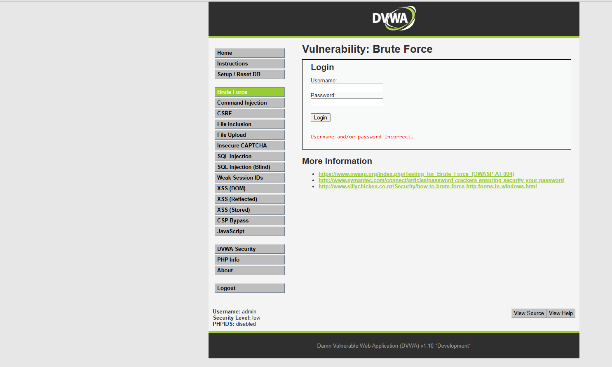
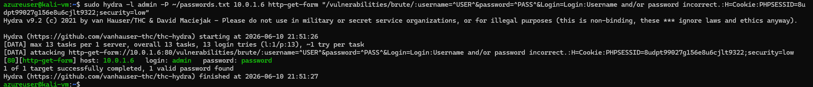
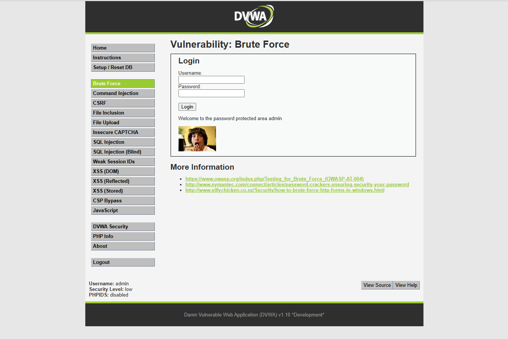
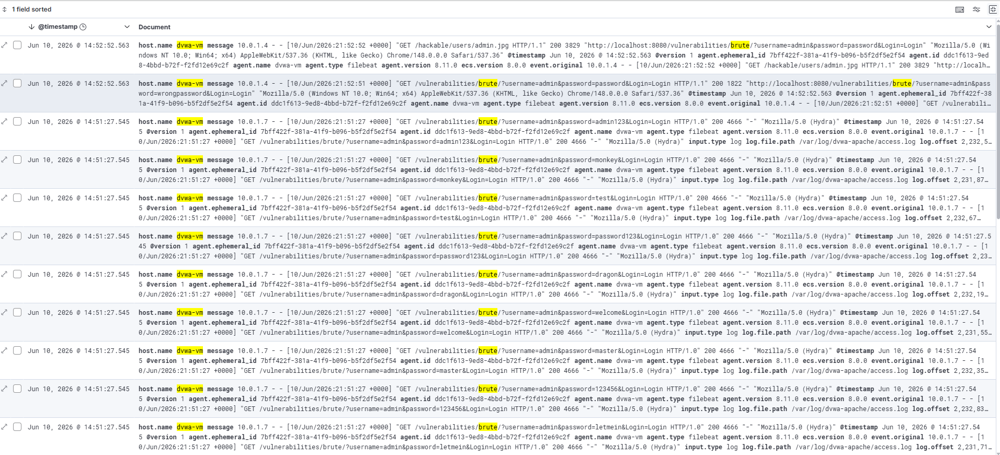

# Incident Report: SOC-2026-006 - Web Application Login Brute Force

| Field | Detail |
| --- | --- |
| Incident ID | SOC-2026-006 |
| Classification | Credential Attack / Web Application Brute Force |
| Severity | High |
| CVSS v3.1 Score | 8.1 - High |
| CVSS Vector | AV:N/AC:L/PR:N/UI:N/S:U/C:H/I:H/A:N |
| Status | Contained |
| Date Detected | June 10, 2026 |
| Date Contained | June 10, 2026 |
| Author | Solomon Lee |
| Last Updated | June 10, 2026 |

---

## 1. Executive Summary

On June 10, 2026, a web application login brute force attack was executed against the DVWA web application (10.0.1.6) targeting the Brute Force module. Using Hydra configured for HTTP form-based authentication, the attacker systematically submitted username and password combinations against the DVWA login endpoint until valid credentials were identified.

The attack successfully discovered working credentials from the password wordlist. Manual verification confirmed the credentials allowed full authenticated access to the DVWA application. All attack requests were logged in the Apache access log and indexed in Elasticsearch. This attack demonstrates how web application login forms without rate limiting or account lockout are vulnerable to the same credential brute force techniques used against SSH — the primary difference being the protocol layer and tooling required.

---

## 2. Severity Rating

| Metric | Rating | Justification |
| --- | --- | --- |
| CVSS v3.1 Score | 8.1 - High | Successful authentication bypass with no lockout protection |
| Attack Vector | Network | Attack delivered via HTTP |
| Attack Complexity | Low | Standard HTTP form brute force, no special conditions |
| Privileges Required | None | No prior authentication required |
| User Interaction | None | Fully automated attack |
| Confidentiality Impact | High | Full application access gained after credential discovery |
| Integrity Impact | High | Authenticated attacker can modify application data |
| Availability Impact | None | Application remained available throughout |

Web login brute force scores slightly lower than SSH brute force because it typically requires knowledge of the login form structure and a valid session cookie. However successful exploitation grants full application access making the real-world impact equivalent.

---

## 3. Affected Systems

| System | IP Address | Role | Impact |
| --- | --- | --- | --- |
| dvwa-vm | 10.0.1.6 | Target - DVWA web application | Exploited - valid credentials discovered and used |
| kali-vm | 10.0.1.7 | Attacker - Kali Linux | Source of attack |
| jump-box | 10.0.1.4 | Bastion host | No impact |
| elk-vm | 10.0.1.5 | SIEM - ELK Stack | Detection platform - no impact |

The DVWA web application was successfully compromised. Valid credentials were discovered and used to gain authenticated access to the application. All functionality available to the admin account was accessible to the attacker following successful authentication.

---

## 4. Incident Details

### How Web Brute Force Differs from SSH Brute Force

| Aspect | SSH Brute Force | Web Login Brute Force |
| --- | --- | --- |
| Protocol | TCP/SSH port 22 | HTTP/HTTPS port 80/443 |
| Tool mode | `ssh://` | `http-get-form` or `http-post-form` |
| Requirements | Target IP and port | Login URL, form field names, failure string |
| Session | Not required | Active session cookie required |
| Detection | auth.log entries | Apache access.log entries |
| Mitigation | Disable password auth | Rate limiting, account lockout, CAPTCHA |

### Attack Prerequisites

Web form brute force requires the attacker to first identify:

1. The login form URL and endpoint
2. The exact form field names for username and password
3. A string that appears in the response when login fails
4. A valid session cookie to maintain state across requests

All of this information was gathered during the Nikto reconnaissance scan documented in writeup 02, demonstrating how reconnaissance directly enables subsequent attacks.

### Vulnerability Description

The DVWA Brute Force module has no rate limiting, no account lockout after failed attempts, and no CAPTCHA. This means an attacker can submit unlimited login attempts at whatever speed the server and network can handle. Hydra exploits this by sending hundreds of attempts per minute until a valid credential pair is found.

---

## 5. Timeline (UTC)

| Time (UTC) | Event |
| --- | --- |
| 20:30:00 | Attacker navigates to DVWA Brute Force module |
| 20:30:10 | Stage 1 - Manual failed login with wrong credentials - baseline confirmed |
| 20:30:20 | Attacker extracts PHPSESSID cookie from browser developer tools |
| 20:30:30 | Hydra launched against http://10.0.1.6/vulnerabilities/brute/ |
| 20:30:30 | Hydra begins submitting username and password combinations via HTTP GET |
| 20:31:00 | Valid credentials identified by Hydra - success string matched |
| 20:31:10 | Attacker manually logs in using discovered credentials |
| 20:31:10 | Full authenticated access to DVWA confirmed |
| 20:31:15 | All HTTP requests logged in Apache access.log |
| 20:31:20 | Filebeat ships events to Elasticsearch |
| 20:32:00 | All attack events visible in Kibana Discover |

---

## 6. Attack Execution and Evidence

### Stage 1 - Manual Failed Login Baseline

Submitted incorrect credentials to confirm failure message format:

```
Username: admin
Password: wrongpassword
```

The failure message "Username and/or password incorrect" was identified. This string is used by Hydra to distinguish failed from successful attempts.



### Stage 2 - Hydra Web Form Brute Force

Hydra was configured to attack the HTTP GET form with the following command:

```bash
sudo hydra -l admin -P ~/passwords.txt 10.0.1.6 http-get-form \
"/vulnerabilities/brute/:username=^USER^&password=^PASS^&Login=Login\
:Username and/or password incorrect.\
:H=Cookie:PHPSESSID=SESSION_ID;security=low"
```

| Component | Purpose |
| --- | --- |
| `-l admin` | Single username to attempt |
| `-P ~/passwords.txt` | Password wordlist |
| `http-get-form` | HTTP GET form attack mode |
| `/vulnerabilities/brute/` | Login endpoint URL |
| `username=^USER^&password=^PASS^` | Form field names with Hydra placeholders |
| `Username and/or password incorrect` | String indicating login failure |
| `H=Cookie:PHPSESSID=...` | Session cookie to maintain authenticated state |

Hydra tested each password in the wordlist sequentially, submitting HTTP GET requests and checking the response for the failure string. When a response did not contain the failure string the credentials were flagged as valid.



### Stage 3 - Successful Authentication Confirmation

The credentials discovered by Hydra were used to manually authenticate to the DVWA application, confirming full access was obtained.



---

## 7. Detection and Evidence

### SIEM Evidence - Kibana Discover

All Hydra HTTP requests were logged by Apache and shipped to Elasticsearch by Filebeat:

```
message: "brute" AND host.name: "dvwa-vm"
```



### How the Attack Appears in Apache Logs

Each Hydra attempt generates one Apache access.log entry:

```
10.0.1.7 - - [10/Jun/2026] "GET /vulnerabilities/brute/?username=admin&password=test1 HTTP/1.1" 200 1842
10.0.1.7 - - [10/Jun/2026] "GET /vulnerabilities/brute/?username=admin&password=test2 HTTP/1.1" 200 1842
10.0.1.7 - - [10/Jun/2026] "GET /vulnerabilities/brute/?username=admin&password=password HTTP/1.1" 200 2156
```

The successful attempt is identifiable by the different response size - the success page returns more content than the failure page. A detection rule monitoring for high request volume to the login endpoint from a single IP would identify this attack pattern.

### Comparison to SSH Brute Force Detection

| Aspect | SSH Brute Force | Web Login Brute Force |
| --- | --- | --- |
| Log source | /var/log/auth.log | Apache access.log |
| Event type | Authentication failure | HTTP 200 response with failure string |
| Current detection | Kibana rule fires, Python auto-blocks | Events logged, no automated alert |
| Gap | None | Needs dedicated web brute force rule |

---

## 8. Impact Assessment

| Category | Rating | Detail |
| --- | --- | --- |
| Confidentiality | High | Full authenticated application access obtained |
| Integrity | High | Authenticated attacker can modify application data and settings |
| Availability | None | Application remained fully available |
| Data Compromised | Valid credentials | Username and password for admin account |
| Records Affected | Admin account | Full application access |
| Financial Loss | Severe in production | Account takeover enables fraud and data theft |
| Regulatory Impact | Severe in production | Unauthorized access constitutes a breach |

### What Authenticated Access Enables

Following successful authentication the attacker had access to every DVWA module including SQL injection, command injection, file upload, and file inclusion. In a production application authenticated access typically provides access to sensitive user data, administrative functions, and potentially internal APIs not accessible to unauthenticated users.

---

## 9. Operational Status

| Phase | Time (UTC) | Status |
| --- | --- | --- |
| Attack begins | 20:30:00 | Services fully operational |
| Valid credentials found | 20:31:00 | Services fully operational |
| Authenticated access confirmed | 20:31:10 | Services fully operational |
| All events in SIEM | 20:32:00 | Services fully operational |
| Incident closed | June 10, 2026 21:00:00 UTC | Resolved |

No services were disrupted. The application remained available throughout the attack. No data was modified during this simulation.

---

## 10. Indicators of Compromise (IOCs)

| Type | Value | Context |
| --- | --- | --- |
| Source IP | 10.0.1.7 | Kali attacker VM |
| Target IP | 10.0.1.6 | DVWA target VM |
| Target Port | 80/TCP | HTTP web application |
| Target URL | `/vulnerabilities/brute/` | Brute force login endpoint |
| Attack Pattern | High volume GET requests to login endpoint | Hundreds of requests per minute |
| Username Targeted | admin | Single username dictionary attack |
| Tool Signature | Hydra request pattern | Sequential password attempts |
| Log Pattern | `brute/?username=admin&password=` | Login endpoint access pattern |
| KQL Query | `message: "brute" AND host.name: "dvwa-vm"` | Kibana detection |

---

## 11. Root Cause Analysis

| Type | Detail |
| --- | --- |
| Primary Cause | No rate limiting on the login endpoint - unlimited attempts permitted |
| Secondary Cause | No account lockout after repeated failed attempts |
| Contributing Factor | No CAPTCHA or challenge mechanism to prevent automated submissions |
| Contributing Factor | Weak password in use - present in common wordlist |
| Contributing Factor | Login failure message too informative - confirms username validity |
| Contributing Factor | No Web Application Firewall to detect abnormal request volume |

---

## 12. Containment and Eradication

| Action | Method | Time (UTC) | Status |
| --- | --- | --- | --- |
| Attack requests logged in SIEM | Apache logs via Filebeat | 20:31:20 | Complete |
| All events indexed in Elasticsearch | Logstash pipeline | 20:32:00 | Complete |
| Session invalidated post-simulation | DVWA session reset | 21:00:00 | Complete |
| Findings documented | This incident report | June 10, 2026 | Complete |

No automated blocking was triggered. The Python alert engine is scoped to SSH brute force on auth.log. A dedicated web brute force detection rule monitoring Apache logs for high request volume to login endpoints would enable automated response for this attack type.

---

## 13. Recovery

In a production environment recovery would require:

- Immediate password reset for the compromised account
- Invalidation of all active sessions for the affected account
- Audit of all actions taken during the authenticated session
- Review of logs to determine if the attacker accessed or modified sensitive data
- User notification if personal data was accessible under the compromised account

In this lab environment no recovery was required as DVWA is a training application with no real user data.

---

## 14. Remediation

### Critical - Fix Immediately in Production

- Implement account lockout after 5 failed login attempts with a 30-minute lockout period
- Add rate limiting at the application or WAF level - maximum 10 login attempts per IP per minute
- Enforce strong password policy - minimum 12 characters, complexity requirements

### High - Implement Within One Week

- Deploy CAPTCHA on the login form to prevent automated submissions
- Implement multi-factor authentication for all accounts
- Use generic error messages that do not distinguish between invalid username and invalid password
- Deploy Web Application Firewall with rules detecting high-volume login attempts

### Medium - Implement Within One Month

- Add Kibana detection rule for high request volume to login endpoints from single IP
- Extend Python alert engine to monitor Apache logs for web brute force patterns
- Implement credential stuffing protection using breach database lookups

---

## 15. Lessons Learned

### What Worked Well

- Apache log pipeline captured every Hydra request with full URL parameters
- The attack progression clearly demonstrated how reconnaissance feeds brute force
- Nikto identified the login page in writeup 02 — directly enabling this attack

### Detection Gap Identified

The current automated response pipeline does not cover web application brute force. The Python alert engine monitors auth.log for SSH failures. The same detection logic applied to Apache logs monitoring for high request volume to login endpoints would close this gap.

Extending the alert engine to cover web brute force is a recommended next step for this project.

### Attack Chain Demonstrated

This writeup completes an attack chain that spans multiple writeups:

```
Writeup 02 - Reconnaissance
    Nikto identifies login page at /vulnerabilities/brute/
    Nikto identifies no rate limiting (OWASP A04)
        |
        v
Writeup 06 - Web Login Brute Force
    Hydra targets the discovered login page
    No rate limiting allows unlimited attempts
    Valid credentials discovered and used
        |
        v
Potential follow-on attacks
    Authenticated SQL injection
    Authenticated command injection
    File upload exploitation
```

This chain illustrates a fundamental principle of offensive security — each phase of an attack builds on information gathered in the previous phase.

---

## 16. MITRE ATT&CK Mapping

| Tactic | Technique | Sub-technique | ID | Detected |
| --- | --- | --- | --- | --- |
| Reconnaissance | Active Scanning | Vulnerability Scanning | T1595.002 | Yes - writeup 02 |
| Initial Access | Valid Accounts | Web Services | T1078.004 | Partial - logged, no alert |
| Credential Access | Brute Force | Password Guessing | T1110.001 | Partial - logged, no alert |
| Credential Access | Brute Force | Credential Stuffing | T1110.004 | Partial - logged, no alert |

---

## Appendix - Detection Pipeline Reference

```
dvwa-vm (/var/log/dvwa-apache/access.log)
    |
    | Apache logs every login attempt including username in GET parameter
    | Example: GET /vulnerabilities/brute/?username=admin&password=test
    | High volume from single IP = brute force signature
    |
    | Filebeat 8.11.0
    |
elk-vm Logstash :5044
    |
    | Grok filter - parses Apache Combined Log Format
    |
Elasticsearch (filebeat-8.11.0-2026.06.10)
    |
    +-- Kibana Discover
            Query: message: "brute" AND host.name: "dvwa-vm"
            All login attempts visible with username in URL parameter
            Successful login identifiable by response size difference
            
Detection Gap:
    No automated alert for web login brute force
    Recommended fix: extend Python alert engine to monitor
    Apache logs for high request volume to login endpoints
```
